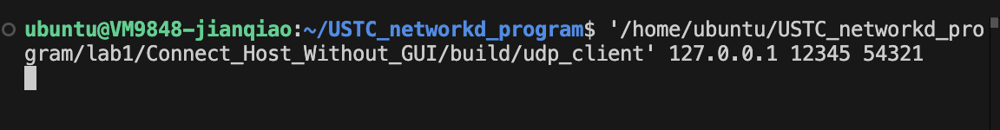
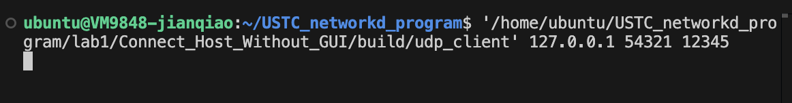
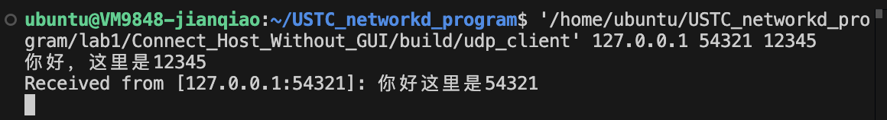
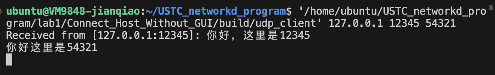
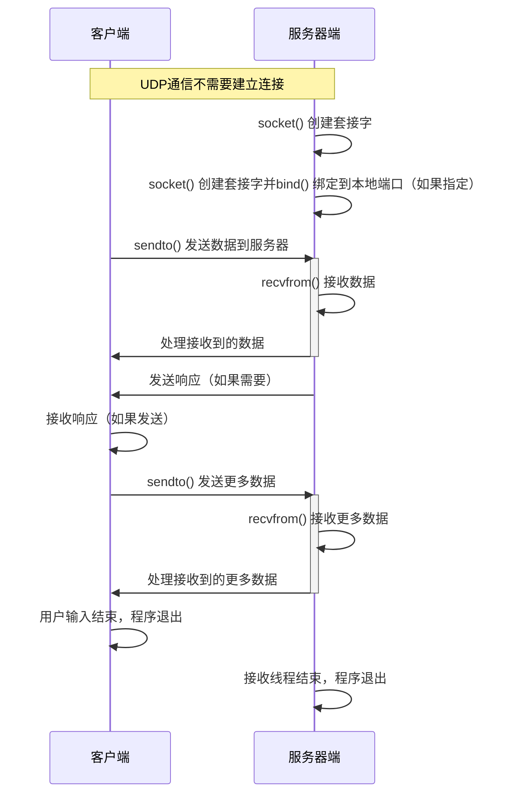

# Lab1- 实现主机之间的相互通信

## 1.实验目的
+ 搭建Linux开发环境
+ 熟悉常用Socket API接口
+ 熟悉网络通信的流程
+ 实现主机间通信

## 2.实验内容
+ 配置实验环境
+ 根据课上的实例程序，实现主机之间的相互通信
+ 提交课程报告

## 3.实验步骤
1. 环境搭建
2. 编写网络实现程序
    + 根据课上所学内容及网上资料实现网络聊天程序的基础：两个主机之间的通信
    + 程序效果：主机1和主机2之间可以实现通信
    + 使用多个c/c++文件编写
    + 用make或cmake编译
3. 进阶实验（可选）
    + 实现图形化界面
    + 相互通信无阻塞感

## 4.实验运行结果

### 4.1 实验结果

1. 在两个主机上分别运行客户端，分别设置程序绑定的端口为12345和54321





2. 实现双方的数据发送





### 4.2 客户端服务器通信流程



### 4.3 关键代码解释

UdpClient 的设计体现了RAII的思想，在构造函数当中建立UDP socket 连接，在析构函数当中对socket关闭。
```cpp
UdpClient::UdpClient(const std::string& serverIp, int serverPort, int localPort) {
    sockfd = socket(AF_INET, SOCK_DGRAM, 0);
    assert(sockfd >= 0);

    memset(&serverAddr, 0, sizeof(serverAddr));
    serverAddr.sin_family = AF_INET;
    inet_pton(AF_INET, serverIp.c_str(), &serverAddr.sin_addr);
    serverAddr.sin_port = htons(serverPort);

    if (localPort > 0) {
        bindToLocalPort(localPort);
    }
}

UdpClient::~UdpClient() {
    close(sockfd);
}
```

bindToLocalPort 将socket绑定到经过用户指定的端口上，如果绑定出错，则将提示错误并且退出程序
```cpp
void UdpClient::bindToLocalPort(int localPort) {
    struct sockaddr_in localAddr;
    memset(&localAddr, 0, sizeof(localAddr));
    localAddr.sin_family = AF_INET;
    localAddr.sin_addr.s_addr = INADDR_ANY;
    localAddr.sin_port = htons(localPort);

    int ret = bind(sockfd, (struct sockaddr*)&localAddr, sizeof(localAddr));
    if (ret < 0) {
        perror("bind failed");
        close(sockfd);
        exit(1);
    }
}
```

为了程序能够独立的处理接收和信息的发送，在MessageReceiver当中设置一个单独的线程receiverThread用于进行接收信息。
```cpp
#ifndef MESSAGE_RECEIVER_H
#define MESSAGE_RECEIVER_H

#include <thread>
#include <atomic>

class MessageReceiver {
public:
    explicit MessageReceiver(int sockfd);
    ~MessageReceiver();

    void start();
    void stop();

private:
    void receiveMessages();
    int sockfd;
    std::atomic<bool> running;
    std::thread receiverThread;
};

#endif // MESSAGE_RECEIVER_H
```

receiveMessages 用于接收信息，是接收线程当中运行的函数。在线程当中维护一个接收缓冲区buf， 在程序当中如果收到了对方发送的信息，用recvfrom接收数据写入buf当中，然后将接收到的信息输出。
```cpp
void MessageReceiver::receiveMessages() {
    char buf[BUFSIZ];
    while (running) {
        bzero(buf, BUFSIZ);
        struct sockaddr_in srcAddr;
        socklen_t addrLen = sizeof(srcAddr);

        ssize_t n = recvfrom(sockfd, buf, BUFSIZ, 0, (struct sockaddr*)&srcAddr, &addrLen);
        if (n > 0) {
            buf[n] = '\0';
            char srcIp[INET_ADDRSTRLEN];
            inet_ntop(AF_INET, &srcAddr.sin_addr, srcIp, INET_ADDRSTRLEN);
            int srcPort = ntohs(srcAddr.sin_port);

            std::cout << "Received from [" << srcIp << ":" << srcPort << "]: " << buf << std::endl;
        } else if (n < 0) {
            perror("recvfrom failed");
            break;
        }
    }
}
```

程序运行的时候，要求在运行的时候给程序输入三个参数，第一个参数为目标主机的ip、目标主机的端口以及程序在本机运行的端口。用这些端口建立UDP连接，传递给UdpClient的构造函数，然后用UDP建立的socket作为MessageReceiver的构造函数的参数。

在MessageReceiver当中有一个线程用于接受信息，在主线程当中，获取本地需要发送的信息，并且使用sendMessage向对方发送
```cpp
int main(int argc, char* argv[]) {
    if (argc < 3 || argc > 4) {
        std::cerr << "Usage: " << argv[0] << " ip_address port_number [local_port]\n";
        return 1;
    }

    std::string ip = argv[1];
    int port = std::stoi(argv[2]);
    int localPort = (argc == 4) ? std::stoi(argv[3]) : 0;

    UdpClient client(ip, port, localPort);
    MessageReceiver receiver(client.getSocket());

    receiver.start();

    std::string message;
    while (std::getline(std::cin, message)) {
        client.sendMessage(message);
    }

    receiver.stop();
    return 0;
}
```


## 附录
### 程序实现的代码

**UdpClient.h**

```cpp
#ifndef UDP_CLIENT_H
#define UDP_CLIENT_H

#include <string>
#include <netinet/in.h>

class UdpClient {
public:
    UdpClient(const std::string& serverIp, int serverPort, int localPort = 0);
    ~UdpClient();

    void sendMessage(const std::string& message);
    int getSocket() const;

private:
    int sockfd;
    struct sockaddr_in serverAddr;

    void bindToLocalPort(int localPort);
};

#endif // UDP_CLIENT_H
```

**UdpClient.cpp**
```cpp
#include "UdpClient.h"
#include <cstring>
#include <unistd.h>
#include <arpa/inet.h>
#include <iostream>
#include <cassert>

UdpClient::UdpClient(const std::string& serverIp, int serverPort, int localPort) {
    sockfd = socket(AF_INET, SOCK_DGRAM, 0);
    assert(sockfd >= 0);

    memset(&serverAddr, 0, sizeof(serverAddr));
    serverAddr.sin_family = AF_INET;
    inet_pton(AF_INET, serverIp.c_str(), &serverAddr.sin_addr);
    serverAddr.sin_port = htons(serverPort);

    if (localPort > 0) {
        bindToLocalPort(localPort);
    }
}

UdpClient::~UdpClient() {
    close(sockfd);
}

void UdpClient::bindToLocalPort(int localPort) {
    struct sockaddr_in localAddr;
    memset(&localAddr, 0, sizeof(localAddr));
    localAddr.sin_family = AF_INET;
    localAddr.sin_addr.s_addr = INADDR_ANY;
    localAddr.sin_port = htons(localPort);

    int ret = bind(sockfd, (struct sockaddr*)&localAddr, sizeof(localAddr));
    if (ret < 0) {
        perror("bind failed");
        close(sockfd);
        exit(1);
    }
}

void UdpClient::sendMessage(const std::string& message) {
    sendto(sockfd, message.c_str(), message.size(), 0, 
           (struct sockaddr*)&serverAddr, sizeof(serverAddr));
}

int UdpClient::getSocket() const {
    return sockfd;
}
```

**MessageReceiver.h**
```cpp
#ifndef MESSAGE_RECEIVER_H
#define MESSAGE_RECEIVER_H

#include <thread>
#include <atomic>

class MessageReceiver {
public:
    explicit MessageReceiver(int sockfd);
    ~MessageReceiver();

    void start();
    void stop();

private:
    void receiveMessages();
    int sockfd;
    std::atomic<bool> running;
    std::thread receiverThread;
};

#endif // MESSAGE_RECEIVER_H
```

**MessageReceiver.cpp**
```cpp
#include "MessageReceiver.h"
#include <iostream>
#include <netinet/in.h>
#include <arpa/inet.h>
#include <unistd.h>
#include <cstring>

#define BUFSIZ 1024

MessageReceiver::MessageReceiver(int sockfd) : sockfd(sockfd), running(false) {}

MessageReceiver::~MessageReceiver() {
    stop();
}

void MessageReceiver::start() {
    running = true;
    receiverThread = std::thread(&MessageReceiver::receiveMessages, this);
}

void MessageReceiver::stop() {
    if (running) {
        running = false;
        if (receiverThread.joinable()) {
            receiverThread.join();
        }
    }
}

void MessageReceiver::receiveMessages() {
    char buf[BUFSIZ];
    while (running) {
        bzero(buf, BUFSIZ);
        struct sockaddr_in srcAddr;
        socklen_t addrLen = sizeof(srcAddr);

        ssize_t n = recvfrom(sockfd, buf, BUFSIZ, 0, (struct sockaddr*)&srcAddr, &addrLen);
        if (n > 0) {
            buf[n] = '\0';
            char srcIp[INET_ADDRSTRLEN];
            inet_ntop(AF_INET, &srcAddr.sin_addr, srcIp, INET_ADDRSTRLEN);
            int srcPort = ntohs(srcAddr.sin_port);

            std::cout << "Received from [" << srcIp << ":" << srcPort << "]: " << buf << std::endl;
        } else if (n < 0) {
            perror("recvfrom failed");
            break;
        }
    }
}
```

**main.cpp**
```cpp
#include "UdpClient.h"
#include "MessageReceiver.h"
#include <iostream>
#include <string>

int main(int argc, char* argv[]) {
    if (argc < 3 || argc > 4) {
        std::cerr << "Usage: " << argv[0] << " ip_address port_number [local_port]\n";
        return 1;
    }

    std::string ip = argv[1];
    int port = std::stoi(argv[2]);
    int localPort = (argc == 4) ? std::stoi(argv[3]) : 0;

    UdpClient client(ip, port, localPort);
    MessageReceiver receiver(client.getSocket());

    receiver.start();

    std::string message;
    while (std::getline(std::cin, message)) {
        client.sendMessage(message);
    }

    receiver.stop();
    return 0;
}
```

**CMakeLists.txt**

```cmake
# Minimum CMake version required
cmake_minimum_required(VERSION 3.10)

# Project name and version
project(UdpClientApp VERSION 1.0)

# Set C++ standard
set(CMAKE_CXX_STANDARD 17)
set(CMAKE_CXX_STANDARD_REQUIRED True)

# Include directories
include_directories(${CMAKE_SOURCE_DIR})

# Source files
set(SOURCES
    main.cpp
    UdpClient.cpp
    MessageReceiver.cpp
)

# Executable target
add_executable(udp_client ${SOURCES})

# Link pthread library
find_package(Threads REQUIRED)
target_link_libraries(udp_client PRIVATE Threads::Threads)

# Compiler warnings (optional, for better development experience)
if(CMAKE_CXX_COMPILER_ID STREQUAL "GNU" OR CMAKE_CXX_COMPILER_ID STREQUAL "Clang")
    target_compile_options(udp_client PRIVATE -Wall -Wextra -Wpedantic)
elseif(CMAKE_CXX_COMPILER_ID STREQUAL "MSVC")
    target_compile_options(udp_client PRIVATE /W4 /permissive-)
endif()
```

