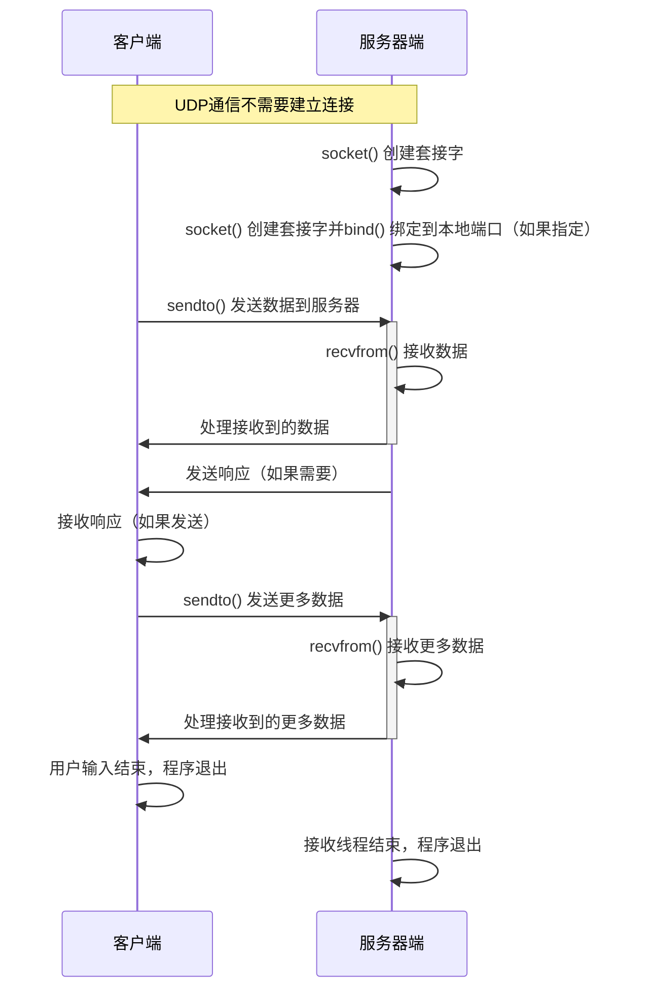

# Lab1- 实现主机之间的相互通信

## 1.实验目的

+ 搭建Linux开发环境
+ 熟悉常用Socket API接口
+ 熟悉网络通信的流程
+ 实现主机间通信

## 2.实验内容

+ 配置实验环境
+ 根据课上的实例程序，实现主机之间的相互通信
+ 提交课程报告

## 3.实验步骤

1. 环境搭建
2. 编写网络实现程序
   + 根据课上所学内容及网上资料实现网络聊天程序的基础：两个主机之间的通信
   + 程序效果：主机1和主机2之间可以实现通信
   + 使用多个c/c++文件编写
   + 用make或cmake编译
3. 进阶实验（可选）
   + 实现图形化界面
   + 相互通信无阻塞感

## 4.实验运行结果

### 4.1 实验结果

1. 在两个主机上分别运行客户端，分别设置程序绑定的端口为12345和54321


2. 实现双方的数据发送


### 4.2 客户端服务器通信流程



### 4.3 关键代码解释

UdpClient 的设计体现了RAII的思想，在构造函数当中建立UDP socket 连接，在析构函数当中对socket关闭。

```cpp
UdpClient::UdpClient(const std::string& serverIp, int serverPort, int localPort) {
    sockfd = socket(AF_INET, SOCK_DGRAM, 0);
    assert(sockfd >= 0);

    memset(&serverAddr, 0, sizeof(serverAddr));
    serverAddr.sin_family = AF_INET;
    inet_pton(AF_INET, serverIp.c_str(), &serverAddr.sin_addr);
    serverAddr.sin_port = htons(serverPort);

    if (localPort > 0) {
        bindToLocalPort(localPort);
    }
}

UdpClient::~UdpClient() {
    close(sockfd);
}
```

bindToLocalPort 将socket绑定到经过用户指定的端口上，如果绑定出错，则将提示错误并且退出程序

```cpp
void UdpClient::bindToLocalPort(int localPort) {
    struct sockaddr_in localAddr;
    memset(&localAddr, 0, sizeof(localAddr));
    localAddr.sin_family = AF_INET;
    localAddr.sin_addr.s_addr = INADDR_ANY;
    localAddr.sin_port = htons(localPort);

    int ret = bind(sockfd, (struct sockaddr*)&localAddr, sizeof(localAddr));
    if (ret < 0) {
        perror("bind failed");
        close(sockfd);
        exit(1);
    }
}
```

为了程序能够独立的处理接收和信息的发送，在MessageReceiver当中设置一个单独的线程receiverThread用于进行接收信息。

```cpp
#ifndef MESSAGE_RECEIVER_H
#define MESSAGE_RECEIVER_H

#include <thread>
#include <atomic>

class MessageReceiver {
public:
    explicit MessageReceiver(int sockfd);
    ~MessageReceiver();

    void start();
    void stop();

private:
    void receiveMessages();
    int sockfd;
    std::atomic<bool> running;
    std::thread receiverThread;
};

#endif // MESSAGE_RECEIVER_H
```

receiveMessages 用于接收信息，是接收线程当中运行的函数。在线程当中维护一个接收缓冲区buf， 在程序当中如果收到了对方发送的信息，用recvfrom接收数据写入buf当中，然后将接收到的信息输出。

```cpp
void MessageReceiver::receiveMessages() {
    char buf[BUFSIZ];
    while (running) {
        bzero(buf, BUFSIZ);
        struct sockaddr_in srcAddr;
        socklen_t addrLen = sizeof(srcAddr);

        ssize_t n = recvfrom(sockfd, buf, BUFSIZ, 0, (struct sockaddr*)&srcAddr, &addrLen);
        if (n > 0) {
            buf[n] = '\0';
            char srcIp[INET_ADDRSTRLEN];
            inet_ntop(AF_INET, &srcAddr.sin_addr, srcIp, INET_ADDRSTRLEN);
            int srcPort = ntohs(srcAddr.sin_port);

            std::cout << "Received from [" << srcIp << ":" << srcPort << "]: " << buf << std::endl;
        } else if (n < 0) {
            perror("recvfrom failed");
            break;
        }
    }
}
```

程序运行的时候，要求在运行的时候给程序输入三个参数，第一个参数为目标主机的ip、目标主机的端口以及程序在本机运行的端口。用这些端口建立UDP连接，传递给UdpClient的构造函数，然后用UDP建立的socket作为MessageReceiver的构造函数的参数。

在MessageReceiver当中有一个线程用于接受信息，在主线程当中，获取本地需要发送的信息，并且使用sendMessage向对方发送

```cpp
int main(int argc, char* argv[]) {
    if (argc < 3 || argc > 4) {
        std::cerr << "Usage: " << argv[0] << " ip_address port_number [local_port]\n";
        return 1;
    }

    std::string ip = argv[1];
    int port = std::stoi(argv[2]);
    int localPort = (argc == 4) ? std::stoi(argv[3]) : 0;

    UdpClient client(ip, port, localPort);
    MessageReceiver receiver(client.getSocket());

    receiver.start();

    std::string message;
    while (std::getline(std::cin, message)) {
        client.sendMessage(message);
    }

    receiver.stop();
    return 0;
}
```

## 5. 进阶实验

为了能够完成两个计算机之间的连接，同时可以提供一个没关的图形界面，采用了前后端分离的技术，在后端用C++实现一个服务器，在前端采用vue.js实现了一个网页，用于和服务器端进行连接。

### 5.1 实验效果

服务端的效果如下


客户端实现的前端网页如下


### 5.2 关键代码

```cpp
WebSocketServer::WebSocketServer() {
    ws_server.init_asio();

    // 设置消息处理函数
    ws_server.set_message_handler([this](websocketpp::connection_hdl hdl, server::message_ptr msg) {
        handle_message(hdl, msg);
    });

    // 设置连接建立处理函数
    ws_server.set_open_handler([this](websocketpp::connection_hdl hdl) {
        on_open(hdl);
    });

    // 设置连接关闭处理函数
    ws_server.set_close_handler([this](websocketpp::connection_hdl hdl) {
        on_close(hdl);
    });
}
```

在构造函数当中完成了下面的操作：

+ ws_server.init_asio();：初始化 WebSocket++ 的 Asio 配置。这是 WebSocket++ 使用 Asio 网络库来处理 I/O 的前提。
+ ws_server.set_message_handler(...)：设置当服务器接收到消息时的回调函数。这里绑定了 handle_message 方法，用于处理客户端发送的消息。
+ ws_server.set_open_handler(...)：设置当有客户端连接时的回调函数。这里绑定了 on_open 方法，用于在客户端连接时执行相关逻辑。
+ ws_server.set_close_handler(...)：设置当客户端断开连接时的回调函数。这里绑定了 on_close 方法，用于在客户端断开时执行清理逻辑。

```cpp
void WebSocketServer::send_message_to_clients(const std::string& message) {
    std::lock_guard<std::mutex> lock(conn_mutex);
    for (auto& conn : connections) {
        try {
            std::string server_message = "Server: " + message; // 添加前缀标识消息来自服务器
            ws_server.send(conn, server_message, websocketpp::frame::opcode::text);
        } catch (const websocketpp::exception& e) {
            std::cout << "Error sending message: " << e.what() << std::endl;
        }
    }
}
```

为了实现客户端和用户端的通信，在服务端收到消息、或者在服务端输入需要发送出去的消息时，将消息使用上面的代码进行发送。为了防止消息出现冲突，在发送前互斥访问消息队列

## 附录

### 程序实现的代码

**UdpClient.h**

```cpp
#ifndef UDP_CLIENT_H
#define UDP_CLIENT_H

#include <string>
#include <netinet/in.h>

class UdpClient {
public:
    UdpClient(const std::string& serverIp, int serverPort, int localPort = 0);
    ~UdpClient();

    void sendMessage(const std::string& message);
    int getSocket() const;

private:
    int sockfd;
    struct sockaddr_in serverAddr;

    void bindToLocalPort(int localPort);
};

#endif // UDP_CLIENT_H
```

**UdpClient.cpp**

```cpp
#include "UdpClient.h"
#include <cstring>
#include <unistd.h>
#include <arpa/inet.h>
#include <iostream>
#include <cassert>

UdpClient::UdpClient(const std::string& serverIp, int serverPort, int localPort) {
    sockfd = socket(AF_INET, SOCK_DGRAM, 0);
    assert(sockfd >= 0);

    memset(&serverAddr, 0, sizeof(serverAddr));
    serverAddr.sin_family = AF_INET;
    inet_pton(AF_INET, serverIp.c_str(), &serverAddr.sin_addr);
    serverAddr.sin_port = htons(serverPort);

    if (localPort > 0) {
        bindToLocalPort(localPort);
    }
}

UdpClient::~UdpClient() {
    close(sockfd);
}

void UdpClient::bindToLocalPort(int localPort) {
    struct sockaddr_in localAddr;
    memset(&localAddr, 0, sizeof(localAddr));
    localAddr.sin_family = AF_INET;
    localAddr.sin_addr.s_addr = INADDR_ANY;
    localAddr.sin_port = htons(localPort);

    int ret = bind(sockfd, (struct sockaddr*)&localAddr, sizeof(localAddr));
    if (ret < 0) {
        perror("bind failed");
        close(sockfd);
        exit(1);
    }
}

void UdpClient::sendMessage(const std::string& message) {
    sendto(sockfd, message.c_str(), message.size(), 0, 
           (struct sockaddr*)&serverAddr, sizeof(serverAddr));
}

int UdpClient::getSocket() const {
    return sockfd;
}
```

**MessageReceiver.h**

```cpp
#ifndef MESSAGE_RECEIVER_H
#define MESSAGE_RECEIVER_H

#include <thread>
#include <atomic>

class MessageReceiver {
public:
    explicit MessageReceiver(int sockfd);
    ~MessageReceiver();

    void start();
    void stop();

private:
    void receiveMessages();
    int sockfd;
    std::atomic<bool> running;
    std::thread receiverThread;
};

#endif // MESSAGE_RECEIVER_H
```

**MessageReceiver.cpp**

```cpp
#include "MessageReceiver.h"
#include <iostream>
#include <netinet/in.h>
#include <arpa/inet.h>
#include <unistd.h>
#include <cstring>

#define BUFSIZ 1024

MessageReceiver::MessageReceiver(int sockfd) : sockfd(sockfd), running(false) {}

MessageReceiver::~MessageReceiver() {
    stop();
}

void MessageReceiver::start() {
    running = true;
    receiverThread = std::thread(&MessageReceiver::receiveMessages, this);
}

void MessageReceiver::stop() {
    if (running) {
        running = false;
        if (receiverThread.joinable()) {
            receiverThread.join();
        }
    }
}

void MessageReceiver::receiveMessages() {
    char buf[BUFSIZ];
    while (running) {
        bzero(buf, BUFSIZ);
        struct sockaddr_in srcAddr;
        socklen_t addrLen = sizeof(srcAddr);

        ssize_t n = recvfrom(sockfd, buf, BUFSIZ, 0, (struct sockaddr*)&srcAddr, &addrLen);
        if (n > 0) {
            buf[n] = '\0';
            char srcIp[INET_ADDRSTRLEN];
            inet_ntop(AF_INET, &srcAddr.sin_addr, srcIp, INET_ADDRSTRLEN);
            int srcPort = ntohs(srcAddr.sin_port);

            std::cout << "Received from [" << srcIp << ":" << srcPort << "]: " << buf << std::endl;
        } else if (n < 0) {
            perror("recvfrom failed");
            break;
        }
    }
}
```

**main.cpp**

```cpp
#include "UdpClient.h"
#include "MessageReceiver.h"
#include <iostream>
#include <string>

int main(int argc, char* argv[]) {
    if (argc < 3 || argc > 4) {
        std::cerr << "Usage: " << argv[0] << " ip_address port_number [local_port]\n";
        return 1;
    }

    std::string ip = argv[1];
    int port = std::stoi(argv[2]);
    int localPort = (argc == 4) ? std::stoi(argv[3]) : 0;

    UdpClient client(ip, port, localPort);
    MessageReceiver receiver(client.getSocket());

    receiver.start();

    std::string message;
    while (std::getline(std::cin, message)) {
        client.sendMessage(message);
    }

    receiver.stop();
    return 0;
}
```

**CMakeLists.txt**

```cmake
# Minimum CMake version required
cmake_minimum_required(VERSION 3.10)

# Project name and version
project(UdpClientApp VERSION 1.0)

# Set C++ standard
set(CMAKE_CXX_STANDARD 17)
set(CMAKE_CXX_STANDARD_REQUIRED True)

# Include directories
include_directories(${CMAKE_SOURCE_DIR})

# Source files
set(SOURCES
    main.cpp
    UdpClient.cpp
    MessageReceiver.cpp
)

# Executable target
add_executable(udp_client ${SOURCES})

# Link pthread library
find_package(Threads REQUIRED)
target_link_libraries(udp_client PRIVATE Threads::Threads)

# Compiler warnings (optional, for better development experience)
if(CMAKE_CXX_COMPILER_ID STREQUAL "GNU" OR CMAKE_CXX_COMPILER_ID STREQUAL "Clang")
    target_compile_options(udp_client PRIVATE -Wall -Wextra -Wpedantic)
elseif(CMAKE_CXX_COMPILER_ID STREQUAL "MSVC")
    target_compile_options(udp_client PRIVATE /W4 /permissive-)
endif()
```

### 拓展实验代码

#### **前端实现的代码**

```vue
<template>
  <div id="app">
    <h1>WebSocket Chat</h1>
    <div>
      <textarea v-model="message" placeholder="Type a message" rows="4" cols="50"></textarea>
      <button @click="sendMessage">Send</button>
    </div>
    <h2>Messages:</h2>
    <ul>
      <li v-for="(msg, index) in messages" :key="index">
        <span v-if="msg.startsWith('Server: ')">
          <strong>{{ msg }}</strong>
        </span>
        <span v-else>
          {{ msg }}
        </span>
      </li>
    </ul>
  </div>
</template>

<script>
export default {
  data() {
    return {
      socket: null,
      message: "",
      messages: [], // 存储从服务器收到的消息
    };
  },
  mounted() {
    // 初始化 WebSocket
    this.socket = new WebSocket("ws://localhost:9002");

    // 监听收到的消息
    this.socket.onmessage = (event) => {
      this.messages.push(event.data); // 将消息添加到本地消息数组
    };

    // 处理 WebSocket 打开事件
    this.socket.onopen = () => {
      console.log("WebSocket connection established.");
    };

    // 处理 WebSocket 关闭事件
    this.socket.onclose = () => {
      console.log("WebSocket connection closed.");
    };

    // 处理 WebSocket 错误
    this.socket.onerror = (error) => {
      console.error("WebSocket error:", error);
    };
  },
  methods: {
    sendMessage() {
      if (this.socket && this.socket.readyState === WebSocket.OPEN) {
        this.socket.send(this.message); // 发送消息到服务器
        this.message = ""; // 清空输入框
      } else {
        alert("WebSocket connection is not open.");
      }
    },
  },
};
</script>

<style>
textarea {
  margin-bottom: 10px;
  display: block;
}
button {
  margin-bottom: 20px;
}
</style>
```

#### **后端服务器实现代码**

**WebSocketServer.hpp**

```cpp
#ifndef WEBSOCKET_SERVER_HPP
#define WEBSOCKET_SERVER_HPP

#include <websocketpp/config/asio_no_tls.hpp>
#include <websocketpp/server.hpp>
#include <deque>
#include <mutex>
#include <string>
#include <vector>

// 类型别名
typedef websocketpp::server<websocketpp::config::asio> server;

class WebSocketServer {
public:
    WebSocketServer();
    void run(uint16_t port);
    void send_message_to_clients(const std::string& message);

private:
    server ws_server;
    std::vector<websocketpp::connection_hdl> connections;
    std::mutex conn_mutex;
    std::deque<std::string> message_queue;
    std::mutex msg_mutex;

    void on_open(websocketpp::connection_hdl hdl);
    void on_close(websocketpp::connection_hdl hdl);
    void handle_message(websocketpp::connection_hdl hdl, server::message_ptr msg);
};

#endif // WEBSOCKET_SERVER_HPP
```


**WebSocketServer.cpp**

```cpp
#include "WebSocketServer.hpp"
#include <iostream>
#include <algorithm>

WebSocketServer::WebSocketServer() {
    ws_server.init_asio();

    // 设置消息处理函数
    ws_server.set_message_handler([this](websocketpp::connection_hdl hdl, server::message_ptr msg) {
        handle_message(hdl, msg);
    });

    // 设置连接建立处理函数
    ws_server.set_open_handler([this](websocketpp::connection_hdl hdl) {
        on_open(hdl);
    });

    // 设置连接关闭处理函数
    ws_server.set_close_handler([this](websocketpp::connection_hdl hdl) {
        on_close(hdl);
    });
}

void WebSocketServer::run(uint16_t port) {
    ws_server.listen(port);
    ws_server.start_accept();
    ws_server.run();
}

void WebSocketServer::send_message_to_clients(const std::string& message) {
    std::lock_guard<std::mutex> lock(conn_mutex);
    for (auto& conn : connections) {
        try {
            std::string server_message = "Server: " + message;
            ws_server.send(conn, server_message, websocketpp::frame::opcode::text);
        } catch (const websocketpp::exception& e) {
            std::cout << "Error sending message: " << e.what() << std::endl;
        }
    }
}

void WebSocketServer::on_open(websocketpp::connection_hdl hdl) {
    std::lock_guard<std::mutex> lock(conn_mutex);
    connections.push_back(hdl);
    std::cout << "Client connected" << std::endl;
}

void WebSocketServer::on_close(websocketpp::connection_hdl hdl) {
    std::lock_guard<std::mutex> lock(conn_mutex);
    connections.erase(std::remove_if(connections.begin(), connections.end(),
                                     [&hdl](const websocketpp::connection_hdl& conn) {
                                         return !conn.owner_before(hdl) && !hdl.owner_before(conn);
                                     }),
                      connections.end());
    std::cout << "Client disconnected" << std::endl;
}

void WebSocketServer::handle_message(websocketpp::connection_hdl hdl, server::message_ptr msg) {
    std::string received_message = msg->get_payload();

    // 将消息保存到队列中
    {
        std::lock_guard<std::mutex> lock(msg_mutex);
        message_queue.push_back(received_message);
        if (message_queue.size() > 100) {
            message_queue.pop_front();
        }
    }

    std::cout << "Received: " << received_message << std::endl;

    // 广播消息到所有连接的客户端
    std::lock_guard<std::mutex> lock(conn_mutex);
    for (auto& conn : connections) {
        try {
            ws_server.send(conn, received_message, websocketpp::frame::opcode::text);
        } catch (const websocketpp::exception& e) {
            std::cout << "Error sending message: " << e.what() << std::endl;
        }
    }
}
```


**main.cpp**

```cpp
#include "WebSocketServer.hpp"
#include <iostream>
#include <thread>

int main() {
    uint16_t port = 9002;
    WebSocketServer server;

    std::cout << "Starting WebSocket server on port " << port << std::endl;
    std::thread server_thread([&server, port]() { server.run(port); });

    // 在服务器端发送消息
    std::string input_message;
    while (true) {
        std::cout << "Enter message to broadcast: ";
        std::getline(std::cin, input_message);
        if (input_message == "exit") break;
        server.send_message_to_clients(input_message); // 调用函数发送消息
    }

    server_thread.join();
    return 0;
}
```


**CMakeLists.txt**

```cmake
cmake_minimum_required(VERSION 3.10)
project(WebSocketServerProject)

set(CMAKE_CXX_STANDARD 17)

# 设置头文件路径
include_directories(include)

# 添加源文件
add_executable(WebSocketServer
    src/main.cpp
    src/WebSocketServer.cpp
)

# 链接 WebSocket++ 依赖项
find_package(Boost REQUIRED system)
target_link_libraries(WebSocketServer Boost::boost Boost::system)
```

