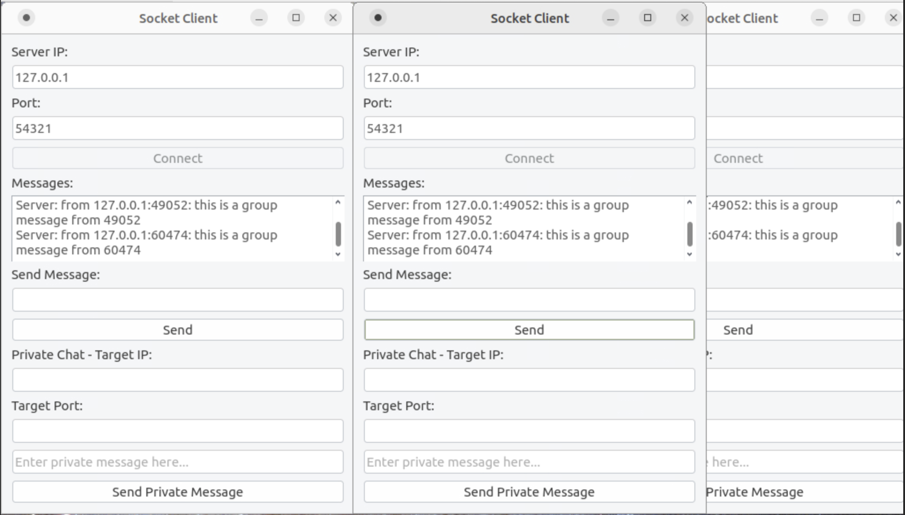

# Lab2-多人聊天程序

## 1. 实验内容

+ 在lab1的基础上使用所学的并发知识实现多人聊天程序 
+ 要求聊天室同时具有群发和私聊两种聊天模式 

## 2. 实验目的

+ 熟练掌握socket API接口

## 3. 程序运行结果

+ 分别启动三个客户端程序，分别连接到服务器，这里可以看到服务器向所有的客户端都发送了新的用户加入的消息


+ 位于端口49052的客户端发送发送了群发消息“this is a group message from 49052”，可以看到各个客户都收到了这条消息


+ 位于端口60474的客户端发送发送了群发消息“this is a group message from 60474”，可以看到各个客户都收到了这条消息



+ 位于40952的用户向60474的发送私聊信息


+ 位于60474的用户向49052的发送私聊信息


+ 服务器信息显示


## 4. 代码实现流程图

### 4.1 客户端代码流程图

**客户端实现的思路**

程序综合了两种通信程序的设计模式——群聊消息的处理采用了客户-服务器模式，私聊消息则采用了p2p模式。

在启动客户端之后选取两个编号相邻的端口分别作为tcp端口和udp端口，其中tcp端口用于和服务器建立连接，并且将ip:tcp端口号座位用户的id标识，udp端口号设置为tcp端口号+1,用于接受和发送私聊信息。

如果发送群发消息，则用TCP端口，将消息发送到服务器。

如果发送私聊信息，要求客户指出需要发送的对方的IP和TCP端口号，客户端会使用udp端口，将消息发送到对方的udp端口当中。


### 4.2 服务器端流程图


## 5. 关键代码解释

### 5.1 服务端关键代码解释

#### 5.1.1 管理Socket的类的初始化

设置Socket类，将关于socket的一系列操作进行封装，设置Ip相关的参数，并且进行绑定

```cpp
Socket::Socket(int port, const char* ip){
    bzero(&address,sizeof(address));
    address.sin_family = AF_INET;
    inet_pton(AF_INET,ip,&address.sin_addr);
    address.sin_port = htons(port);

    listenfd = socket(PF_INET,SOCK_STREAM,0);
    assert(listenfd >= 0);

    int ret = bind(listenfd,(struct sockaddr*)&address,sizeof(address));
    assert(ret != -1);

    ret = listen(listenfd,5);
    assert(ret != -1);
}
```


#### 5.1.2 服务器端运行代码

1. 首先完成对于poll的设置，用于完成多路复用相关的操作
2. 在完成对于poll的设置之后，对于poll相关的fds数组进行遍历，检查文件描述符上是否有需要处理的时间
   + 文件描述符上面有新的连接，则检查是否连接已经到达了最大值，如果没有达到最大值则允许，如果达到了最大值则拒接连接
   + 如果监测到有发送过来的消息，则接受消息并且将消息向所有的客户发送
   + 如果发现客户端关闭，则关闭连接
   + 如果出错了，则处理错误并且关闭连接
3. 在结束之后，关闭所有连接，并对于资源进行处理

```cpp

void ChatServer::run(){
    while(1){
        /*
            poll函数:
            int poll(struct pollfd fds[],nfds_t nfds,int timeout);
            fds:指向一个结构体数组的指针
            nfds:数组中结构体的数量
            timeout:超时时间
            返回值:就绪的文件描述符的数量
            作用：等待一组文件描述符的事件
        */
        int ret = poll(fds,user_counter+1,-1);//阻塞
        if(ret < 0){
            printf("poll failure\n");
            break;
        }
        for(int i=0; i<user_counter+1; i++){
            /*
                遍历fds数组，处理每一个就绪的文件描述符
            */
            if((fds[i].fd == sk.listenfd) && (fds[i].revents & POLLIN)){
                //有新的连接
                struct sockaddr_in client_address;
                socklen_t client_addrlength = sizeof(client_address);
                int connfd = accept(sk.listenfd,(struct sockaddr*)&client_address,&client_addrlength);
                if(connfd < 0){
                    printf("errno is: %d\n",errno);
                    continue;
                }
                if(user_counter >= USER_LIMIT){
                    //连接太多
                    const char* info = "too many users\n";
                    printf("%s",info);
                    send(connfd,info,strlen(info),0);
                    close(connfd);
                    continue;
                }
                user_counter++;
                users[connfd].address = client_address;//保存客户端地址
                setnonblocking(connfd);// 设置非阻塞
                fds[user_counter].fd = connfd;//将新的连接加入到fds数组中
                fds[user_counter].events = POLLIN | POLLRDHUP | POLLERR;//监听可读、对端关闭、错误事件
                fds[user_counter].revents = 0;//初始化为0
                printf("comes a new user,now have %d users\n",user_counter);
                // 向所有的客户群发新用户的信息，告诉所有用户新的用户的 ip 和 port
                char welcome[100];
                memset(welcome,'\0',100);
                
                strcat(welcome,inet_ntoa(client_address.sin_addr));
                strcat(welcome,":");
                strcat(welcome,std::to_string(ntohs(client_address.sin_port)).c_str());
                strcat(welcome," is online\n");

                send_msg_to_all(welcome);


            }else if(fds[i].revents & POLLERR){
                //出错
                printf("get an error from %d\n",fds[i].fd);
                char errors[100];
                memset(errors,'\0',100);
                socklen_t length = sizeof(errors);
                if(getsockopt(fds[i].fd,SOL_SOCKET,SO_ERROR,&errors,&length) < 0){
                    //获取socket选项失败
                    printf("get socket option failed\n");
                }
                continue;
            }else if(fds[i].revents & POLLRDHUP){
                //客户端关闭连接
                users[fds[i].fd] = users[fds[user_counter].fd];//将最后一个用户的数据拷贝到当前位置
                close(fds[i].fd);//关闭当前位置的文件描述符
                fds[i] = fds[user_counter];//将最后一个文件描述符的数据拷贝到当前位置
                i--;
                user_counter--;
                printf("a client left\n");
                
                // 向所有的用户发送离开的用户的ip和port
                char leave[100];
                memset(leave,'\0',100);
                strcat(leave,"a user left\n");
                strcat(leave,inet_ntoa(users[fds[i].fd].address.sin_addr));
                strcat(leave,":");
                strcat(leave,std::to_string(ntohs(users[fds[i].fd].address.sin_port)).c_str());
                strcat(leave," is offline\n");

                send_msg_to_all(leave);

            }else if(fds[i].revents & POLLIN){//可读事件
                //处理客户端数据
                int connfd = fds[i].fd;
                
                memset(users[connfd].buf,'\0',BUFFER_SIZE);
                char from_which_client[100] = "from ";
                strcat(from_which_client,inet_ntoa(users[connfd].address.sin_addr));
                strcat(from_which_client,":");
                strcat(from_which_client,std::to_string(ntohs(users[connfd].address.sin_port)).c_str());
                strcat(from_which_client,": ");
                strcat(users[connfd].buf,from_which_client);
                ret = recv(connfd,users[connfd].buf + strlen(from_which_client),BUFFER_SIZE-1,0);
                printf("get %d bytes of client data %s from %d\n",ret,users[connfd].buf,connfd);
                if(ret < 0){
                    if(errno != EAGAIN){
                        close(connfd);
                        users[fds[i].fd] = users[fds[user_counter].fd];
                        fds[i] = fds[user_counter];
                        i--;
                        user_counter--;
                    }
                }else if(ret == 0){
                    //对端关闭连接
                    printf("code should not come to here\n");
                }else{
                    //将数据发送给其他客户端
                    for(int j=1;j<=user_counter;j++){
                        fds[j].events |= ~POLLIN; //取消监听可读事件
                        fds[j].events |= POLLOUT; //监听可写事件
                        users[fds[j].fd].write_buf = users[connfd].buf;
                    }
                }
            }
        }
    }

    delete [] users;
    close(sk.listenfd);

}

```

### 5.2 客户端关键代码解释

#### 5.2.1 客户端和服务端建立相关的连接

在connectToServer当中，将本地收到的服务端的ip地址和端口号建立连接，本地的tcp端口号为随机选取一个可用的端口号。

随后将tcp端口号+1 设置为本地的udp端口号，如果这个端口号被占用，则重新分配tcp和udp端口号，重复三次，如果三次依然没有成功，则退出程序。

```cpp
void ClientApp::connectToServer() {
    QString ip = ipInput->text();
    int port = portInput->text().toInt();

    socket->connectToHost(ip, port);

    if (socket->waitForConnected(3000)) { // 3 seconds timeout
        QMessageBox::information(this, "Success", "Connected to server!");
        connectButton->setEnabled(false);
        sendButton->setEnabled(true);

        // 本地tcp端口
        int localPort = socket->localPort();

        if (!bindUdpSocket(localPort)) {
            retryUdpBinding(ip, localPort);
        }
    } else {
        QMessageBox::critical(this, "Error", "Failed to connect to server.");
    }
}

bool ClientApp::bindUdpSocket(int port) {
    // 获取tcp端口，udp端口+1
    quint16 udpPort = port+1;
    if (udpSocket->bind(QHostAddress::Any, udpPort)) {
        messageDisplay->append(QString("UDP socket bound to port %1").arg(udpPort));
        retryCount = 0; // Reset retry count on success
        return true;
    } else {
        messageDisplay->append("Failed to bind UDP socket. Retrying...");
        return false;
    }
}

void ClientApp::retryUdpBinding(const QString &ip, int port) {
    while (retryCount < 3) {
        retryCount++;
        socket->disconnectFromHost();
        socket->connectToHost(ip, port);

        if (socket->waitForConnected(3000)) {
            int localPort = socket->localPort();
            if (bindUdpSocket(localPort)) {
                return; // Binding succeeded
            }
        }
    }

    QMessageBox::critical(this, "Error", "Failed to bind UDP socket after 3 attempts. Exiting.");
    QApplication::quit();
}
```

#### 5.2.2 对于群发数据的处理

将客户端文本框当中的数据进行向服务端进行发送。将服务端收到的消息进行显示

```cpp
void ClientApp::sendMessage() {
    QString message = messageInput->text();
    if (!message.isEmpty()) {
        socket->write(message.toUtf8());
        socket->flush();
        messageInput->clear();
    }
}

void ClientApp::readMessage() {
    QByteArray data = socket->readAll();
    messageDisplay->append("Server: " + QString(data));
}
```

#### 5.2.3 私法数据的处理

由于服务器在接受的时候只是向客户告知加入的用户的tcp端口号，因此在这里选择使用tcp端口号区分不同用户的关键字，在私发的时候也要求输入tcp端口号和ip地址，因为本地规定，udp端口号为tcp端口号+1，因此发送的时候将输入的tcp端口号+1得到udp端口号，进行发送信息。在接收的时候，将对面的端口号-1,得到tcp端口号，用于告诉本地用户对面的身份。

```cpp
void ClientApp::sendPrivateMessage() {
    QString targetIp = targetIpInput->text();
    int targetPort = tcpPortToUdpPort(targetPortInput->text().toInt());
    QString privateMessage = privateMessageInput->text();

    if (!targetIp.isEmpty() && targetPort > 0 && !privateMessage.isEmpty()) {
        QByteArray data = privateMessage.toUtf8();
        udpSocket->writeDatagram(data, QHostAddress(targetIp), targetPort);
        privateMessageInput->clear();
        messageDisplay->append("You (private): " + privateMessage);
    } else {
        QMessageBox::warning(this, "Error", "Please fill in all private chat fields.");
    }
}

void ClientApp::receivePrivateMessage() {
    while (udpSocket->hasPendingDatagrams()) {
        QByteArray buffer;
        buffer.resize(udpSocket->pendingDatagramSize());

        QHostAddress senderIp;
        quint16 senderPort;

        // Receive datagram
        udpSocket->readDatagram(buffer.data(), buffer.size(), &senderIp, &senderPort);

        QString message = QString::fromUtf8(buffer);
        messageDisplay->append(QString("Private (%1:%2): %3")
                               .arg(senderIp.toString())
                               .arg(udpPortToTcpPort(senderPort))
                               .arg(message));
    }
}

int ClientApp::udpPortToTcpPort(int udpPort) {
    return udpPort - 1;
}

int ClientApp::tcpPortToUdpPort(int tcpPort) {
    return tcpPort + 1;
}


```

## 6. 模型优缺点分析

### 缺点：

+ 本地由于强制采用了两个相邻的端口，如果系统当中难以找到两个相邻的端口会导致程序无法正常工作
+ 私聊采用udp进行传送，由于UDP是不可靠的，因此如果通信环境比较复杂，则无法保证消息正确的、完整的送达
+ 在内网当中可以很好的工作，但是如果采用NAT，在信息传输的过程当中发生了IP和端口号的转换，本程序将不能够正确工作。一个好的解决办法是在server维护一个数据库或者一个map的数据结构，完成用户ID到ip和端口号的转换，可以在后续的过程当中进行改进。
+ 仅采用了IPv4,没有做关于IPv6的相关适配

### 优点
+ 在本程序当中，服务器的负担比较小，只用于处理群聊和登陆相关的操作，将压力下放给了客户端
+ 实现比较简单，对于硬件的要求和负担比较小


## 附录

### 服务器端代码

#### src/ChatServer.hpp
```cpp
#ifndef __CHATSERVER_HPP__
#define __CHATSERVER_HPP__

#include "Socket.hpp"
#include "client_data.hpp"
#include "config.hpp"
#include <poll.h>
#include <string.h>
#include <arpa/inet.h>
#include <fcntl.h>
#include <stdio.h>
#include <stdlib.h>
#include <errno.h>
#include <string>

class ChatServer{
public:
    ChatServer(int port, const char* ip);
private:
    void init();
    Socket sk;
    client_data* users;
    pollfd fds[USER_LIMIT+1];
    int user_counter;
    int setnonblocking(int fd){
        int old_option = fcntl(fd,F_GETFL);
        int new_option = old_option | O_NONBLOCK;
        fcntl(fd,F_SETFL,new_option);
        return old_option;
    }

public:
    void run();

    void send_msg_to_all(char* msg){
        for(int i=1;i<=user_counter;i++){
            if(fds[i].fd != -1){
                send(fds[i].fd,msg,strlen(msg),0);
            }
        }
    }
};


#endif // __CHATSERVER_HPP__
```

#### src/ChatServer.cpp

```cpp
#include "ChatServer.hpp"
#include <unistd.h>


ChatServer::ChatServer(int port, const char* ip):sk(port, ip){
    init();
}

void ChatServer:: init(){
    users = new client_data[FD_LIMIT];//分配FD_LIMIT个client_data结构体
    user_counter = 0;

    // 对于每一个用户，初始化pollfd结构体
    for(int i = 1;i <= USER_LIMIT;++i){
        fds[i].fd = -1;//初始化为-1
        fds[i].events = 0;//初始化为0
    }

    // 初始化监听套接字
    fds[0].fd = sk.listenfd;
    fds[0].events = POLLIN | POLLERR;
    fds[0].revents = 0;
}

void ChatServer::run(){
    while(1){
        /*
            poll函数:
            int poll(struct pollfd fds[],nfds_t nfds,int timeout);
            fds:指向一个结构体数组的指针
            nfds:数组中结构体的数量
            timeout:超时时间
            返回值:就绪的文件描述符的数量
            作用：等待一组文件描述符的事件
        */
        int ret = poll(fds,user_counter+1,-1);//阻塞
        if(ret < 0){
            printf("poll failure\n");
            break;
        }
        for(int i=0; i<user_counter+1; i++){
            /*
                遍历fds数组，处理每一个就绪的文件描述符
            */
            if((fds[i].fd == sk.listenfd) && (fds[i].revents & POLLIN)){
                //有新的连接
                struct sockaddr_in client_address;
                socklen_t client_addrlength = sizeof(client_address);
                int connfd = accept(sk.listenfd,(struct sockaddr*)&client_address,&client_addrlength);
                if(connfd < 0){
                    printf("errno is: %d\n",errno);
                    continue;
                }
                if(user_counter >= USER_LIMIT){
                    //连接太多
                    const char* info = "too many users\n";
                    printf("%s",info);
                    send(connfd,info,strlen(info),0);
                    close(connfd);
                    continue;
                }
                user_counter++;
                users[connfd].address = client_address;//保存客户端地址
                setnonblocking(connfd);// 设置非阻塞
                fds[user_counter].fd = connfd;//将新的连接加入到fds数组中
                fds[user_counter].events = POLLIN | POLLRDHUP | POLLERR;//监听可读、对端关闭、错误事件
                fds[user_counter].revents = 0;//初始化为0
                printf("comes a new user,now have %d users\n",user_counter);
                // 向所有的客户群发新用户的信息，告诉所有用户新的用户的 ip 和 port
                char welcome[100];
                memset(welcome,'\0',100);
                
                strcat(welcome,inet_ntoa(client_address.sin_addr));
                strcat(welcome,":");
                strcat(welcome,std::to_string(ntohs(client_address.sin_port)).c_str());
                strcat(welcome," is online\n");

                // for(int j=1;j<=user_counter;j++){
                //     if(fds[j].fd == connfd){
                //         //跳过自己
                //         continue;
                //     }
                //     fds[j].events |= ~POLLIN; //取消监听可读事件
                //     fds[j].events |= POLLOUT; //监听可写事件
                //     users[fds[j].fd].write_buf = welcome;
                // }
                send_msg_to_all(welcome);


            }else if(fds[i].revents & POLLERR){
                //出错
                printf("get an error from %d\n",fds[i].fd);
                char errors[100];
                memset(errors,'\0',100);
                socklen_t length = sizeof(errors);
                if(getsockopt(fds[i].fd,SOL_SOCKET,SO_ERROR,&errors,&length) < 0){
                    //获取socket选项失败
                    printf("get socket option failed\n");
                }
                continue;
            }else if(fds[i].revents & POLLRDHUP){
                //客户端关闭连接
                users[fds[i].fd] = users[fds[user_counter].fd];//将最后一个用户的数据拷贝到当前位置
                close(fds[i].fd);//关闭当前位置的文件描述符
                fds[i] = fds[user_counter];//将最后一个文件描述符的数据拷贝到当前位置
                i--;
                user_counter--;
                printf("a client left\n");
                
                // 向所有的用户发送离开的用户的ip和port
                char leave[100];
                memset(leave,'\0',100);
                strcat(leave,"a user left\n");
                strcat(leave,inet_ntoa(users[fds[i].fd].address.sin_addr));
                strcat(leave,":");
                strcat(leave,std::to_string(ntohs(users[fds[i].fd].address.sin_port)).c_str());
                strcat(leave," is offline\n");

                // for(int j=1;j<=user_counter;j++){
                //     if(fds[j].fd == fds[i].fd){
                //         //跳过自己
                //         continue;
                //     }
                //     fds[j].events |= ~POLLIN; //取消监听可读事件
                //     fds[j].events |= POLLOUT; //监听可写事件
                //     users[fds[j].fd].write_buf = leave;
                // }
                send_msg_to_all(leave);

            }else if(fds[i].revents & POLLIN){//可读事件
                //处理客户端数据
                int connfd = fds[i].fd;
                
                memset(users[connfd].buf,'\0',BUFFER_SIZE);
                char from_which_client[100] = "from ";
                strcat(from_which_client,inet_ntoa(users[connfd].address.sin_addr));
                strcat(from_which_client,":");
                strcat(from_which_client,std::to_string(ntohs(users[connfd].address.sin_port)).c_str());
                strcat(from_which_client,": ");
                strcat(users[connfd].buf,from_which_client);
                ret = recv(connfd,users[connfd].buf + strlen(from_which_client),BUFFER_SIZE-1,0);
                printf("get %d bytes of client data %s from %d\n",ret,users[connfd].buf,connfd);
                if(ret < 0){
                    if(errno != EAGAIN){
                        close(connfd);
                        users[fds[i].fd] = users[fds[user_counter].fd];
                        fds[i] = fds[user_counter];
                        i--;
                        user_counter--;
                    }
                }else if(ret == 0){
                    //对端关闭连接
                    printf("code should not come to here\n");
                }else{
                    //将数据发送给其他客户端
                    for(int j=1;j<=user_counter;j++){
                        // if(fds[j].fd == connfd){
                        //     //跳过自己
                        //     continue;
                        // }
                        fds[j].events |= ~POLLIN; //取消监听可读事件
                        fds[j].events |= POLLOUT; //监听可写事件
                        users[fds[j].fd].write_buf = users[connfd].buf;
                    }
                }
            }else if(fds[i].revents & POLLOUT){
                //可写事件
                int connfd = fds[i].fd;
                if(!users[connfd].write_buf){
                    continue;
                }
                ret = send(connfd,users[connfd].write_buf,strlen(users[connfd].write_buf),0);
                users[connfd].write_buf = NULL;
                fds[i].events |= ~POLLOUT;
                fds[i].events |= POLLIN;
            }
        }
    }

    delete [] users;
    close(sk.listenfd);

}

```

#### src/client_data.hpp
```cpp
#ifndef __CLIENT_DATA_HPP__
#define __CLIENT_DATA_HPP__

#include <arpa/inet.h>
#include <string.h>
#include "config.hpp"

struct client_data{
    sockaddr_in address;
    char* write_buf;
    char buf[BUFFER_SIZE];
};

#endif // __CLIENT_DATA_HPP__
```

#### src/config.hpp
```cpp
#ifndef __CONFIG_HPP__
#define __CONFIG_HPP__


#define BUFFER_SIZE 64
#define USER_LIMIT 5
#define FD_LIMIT 65535

#endif // __CONFIG_HPP__
```

#### src/Socket.hpp

```cpp
#ifndef __SOCKET_HPP__
#define __SOCKET_HPP__

#include <assert.h>
#include <string.h>
#include <arpa/inet.h>
#include <sys/socket.h>
#include <netinet/in.h>
#include <stdlib.h>
#include <stdio.h>

class Socket{
    friend class ChatServer;
public:
    Socket(int port, const char* ip);

private:
    struct sockaddr_in address;
    int listenfd;
};


#endif // __SOCKET_HPP__
```

#### src/Socket.cpp

```cpp
#include "Socket.hpp"


Socket::Socket(int port, const char* ip){
    bzero(&address,sizeof(address));
    address.sin_family = AF_INET;
    inet_pton(AF_INET,ip,&address.sin_addr);
    address.sin_port = htons(port);

    listenfd = socket(PF_INET,SOCK_STREAM,0);
    assert(listenfd >= 0);

    int ret = bind(listenfd,(struct sockaddr*)&address,sizeof(address));
    assert(ret != -1);

    ret = listen(listenfd,5);
    assert(ret != -1);
}
```

#### src/main.cpp
```cpp
#define _GNU_SOURCE 1

#include "ChatServer.hpp"
#include "config.hpp"


int main(int argc, char *argv[]){
    if(argc <= 2){
        printf("usage: %s ip_address port_number\n",basename(argv[0]));
        return 1;
    }
    const char* ip = argv[1];
    int port = atoi(argv[2]);

    ChatServer server(port, ip);
    server.run();

    return 0;
}
```

#### CMakeLists.txt

```cpp
# Project name
PROJECT(server)

# Set C++ standard
SET(CMAKE_CXX_STANDARD 11)

# Set source files
# 设置源文为./src 文件夹下面的所有以cpp结尾的文件
FILE(GLOB_RECURSE SRC_FILES ${CMAKE_CURRENT_SOURCE_DIR}/src/*.cpp)

add_executable(server ${SRC_FILES})

```

### 客户端代码

#### src/ClientApp.h

```cpp
#pragma once

#include <QWidget>
#include <QTcpSocket>
#include <QUdpSocket>
#include <QVBoxLayout>
#include <QLineEdit>
#include <QPushButton>
#include <QTextEdit>
#include <QLabel>
#include <QMessageBox>

class ClientApp : public QWidget {
    Q_OBJECT

public:
    explicit ClientApp(QWidget *parent = nullptr);

private slots:
    void connectToServer();
    bool bindUdpSocket(int port);
    void retryUdpBinding(const QString &ip, int port);
    void sendMessage();
    void readMessage();
    void onDisconnected();
    void sendPrivateMessage();
    void receivePrivateMessage();

private:
    QLineEdit *ipInput;
    QLineEdit *portInput;
    QPushButton *connectButton;
    QTextEdit *messageDisplay;
    QLineEdit *messageInput;
    QPushButton *sendButton;

    // Private chat widgets
    QLineEdit *targetIpInput;
    QLineEdit *targetPortInput;
    QLineEdit *privateMessageInput;
    QPushButton *privateSendButton;

    QTcpSocket *socket;
    QUdpSocket *udpSocket; // UDP Socket
    int retryCount;

    int udpPortToTcpPort(int udpPort);
    int tcpPortToUdpPort(int tcpPort);
};
```

#### src/ClientApp.cpp

```cpp
#include "ClientApp.h"
#include <QVBoxLayout>
#include <QLineEdit>
#include <QPushButton>
#include <QTextEdit>
#include <QLabel>
#include <QTcpSocket>
#include <QUdpSocket>
#include <QMessageBox>
#include <QApplication>

ClientApp::ClientApp(QWidget *parent) : QWidget(parent), retryCount(0) {
    setWindowTitle("Socket Client");

    // Layout and Widgets
    QVBoxLayout *layout = new QVBoxLayout(this);

    // IP and Port
    layout->addWidget(new QLabel("Server IP:"));
    ipInput = new QLineEdit(this);
    layout->addWidget(ipInput);

    layout->addWidget(new QLabel("Port:"));
    portInput = new QLineEdit(this);
    layout->addWidget(portInput);

    // Connect Button
    connectButton = new QPushButton("Connect", this);
    layout->addWidget(connectButton);

    // Message display area
    layout->addWidget(new QLabel("Messages:"));
    messageDisplay = new QTextEdit(this);
    messageDisplay->setReadOnly(true);
    layout->addWidget(messageDisplay);

    // Input and Send Button
    layout->addWidget(new QLabel("Send Message:"));
    messageInput = new QLineEdit(this);
    layout->addWidget(messageInput);

    sendButton = new QPushButton("Send", this);
    sendButton->setEnabled(false);
    layout->addWidget(sendButton);

    // Private chat section
    layout->addWidget(new QLabel("Private Chat - Target IP:"));
    targetIpInput = new QLineEdit(this);
    layout->addWidget(targetIpInput);

    layout->addWidget(new QLabel("Target Port:"));
    targetPortInput = new QLineEdit(this);
    layout->addWidget(targetPortInput);

    privateMessageInput = new QLineEdit(this);
    privateMessageInput->setPlaceholderText("Enter private message here...");
    layout->addWidget(privateMessageInput);

    privateSendButton = new QPushButton("Send Private Message", this);
    privateSendButton->setEnabled(true);
    layout->addWidget(privateSendButton);

    // Socket setup
    socket = new QTcpSocket(this);
    udpSocket = new QUdpSocket(this);

    // Signals and Slots
    connect(connectButton, &QPushButton::clicked, this, &ClientApp::connectToServer);
    connect(sendButton, &QPushButton::clicked, this, &ClientApp::sendMessage);
    connect(socket, &QTcpSocket::readyRead, this, &ClientApp::readMessage);
    connect(socket, &QTcpSocket::disconnected, this, &ClientApp::onDisconnected);
    connect(privateSendButton, &QPushButton::clicked, this, &ClientApp::sendPrivateMessage);
    connect(udpSocket, &QUdpSocket::readyRead, this, &ClientApp::receivePrivateMessage);
}

void ClientApp::connectToServer() {
    QString ip = ipInput->text();
    int port = portInput->text().toInt();

    socket->connectToHost(ip, port);

    if (socket->waitForConnected(3000)) { // 3 seconds timeout
        QMessageBox::information(this, "Success", "Connected to server!");
        connectButton->setEnabled(false);
        sendButton->setEnabled(true);

        // 本地tcp端口
        int localPort = socket->localPort();

        if (!bindUdpSocket(localPort)) {
            retryUdpBinding(ip, localPort);
        }
    } else {
        QMessageBox::critical(this, "Error", "Failed to connect to server.");
    }
}

bool ClientApp::bindUdpSocket(int port) {
    // 获取tcp端口，udp端口+1
    quint16 udpPort = port+1;
    if (udpSocket->bind(QHostAddress::Any, udpPort)) {
        messageDisplay->append(QString("UDP socket bound to port %1").arg(udpPort));
        retryCount = 0; // Reset retry count on success
        return true;
    } else {
        messageDisplay->append("Failed to bind UDP socket. Retrying...");
        return false;
    }
}

void ClientApp::retryUdpBinding(const QString &ip, int port) {
    while (retryCount < 3) {
        retryCount++;
        socket->disconnectFromHost();
        socket->connectToHost(ip, port);

        if (socket->waitForConnected(3000)) {
            int localPort = socket->localPort();
            if (bindUdpSocket(localPort)) {
                return; // Binding succeeded
            }
        }
    }

    QMessageBox::critical(this, "Error", "Failed to bind UDP socket after 3 attempts. Exiting.");
    QApplication::quit();
}

void ClientApp::sendMessage() {
    QString message = messageInput->text();
    if (!message.isEmpty()) {
        socket->write(message.toUtf8());
        socket->flush();
        messageInput->clear();
    }
}

void ClientApp::readMessage() {
    QByteArray data = socket->readAll();
    messageDisplay->append("Server: " + QString(data));
}

void ClientApp::onDisconnected() {
    QMessageBox::information(this, "Disconnected", "Server has closed the connection.");
    connectButton->setEnabled(true);
    sendButton->setEnabled(false);
}

void ClientApp::sendPrivateMessage() {
    QString targetIp = targetIpInput->text();
    int targetPort = tcpPortToUdpPort(targetPortInput->text().toInt());
    QString privateMessage = privateMessageInput->text();

    if (!targetIp.isEmpty() && targetPort > 0 && !privateMessage.isEmpty()) {
        QByteArray data = privateMessage.toUtf8();
        udpSocket->writeDatagram(data, QHostAddress(targetIp), targetPort);
        privateMessageInput->clear();
        messageDisplay->append("You (private): " + privateMessage);
    } else {
        QMessageBox::warning(this, "Error", "Please fill in all private chat fields.");
    }
}

void ClientApp::receivePrivateMessage() {
    while (udpSocket->hasPendingDatagrams()) {
        QByteArray buffer;
        buffer.resize(udpSocket->pendingDatagramSize());

        QHostAddress senderIp;
        quint16 senderPort;

        // Receive datagram
        udpSocket->readDatagram(buffer.data(), buffer.size(), &senderIp, &senderPort);

        QString message = QString::fromUtf8(buffer);
        messageDisplay->append(QString("Private (%1:%2): %3")
                               .arg(senderIp.toString())
                               .arg(udpPortToTcpPort(senderPort))
                               .arg(message));
    }
}

int ClientApp::udpPortToTcpPort(int udpPort) {
    return udpPort - 1;
}

int ClientApp::tcpPortToUdpPort(int tcpPort) {
    return tcpPort + 1;
}

```

#### src/main.cpp

```cpp
#include <QApplication>
#include "ClientApp.h"

int main(int argc, char *argv[]) {
    QApplication app(argc, argv);

    ClientApp client;
    client.resize(400, 500);
    client.show();

    return app.exec();
}
```

#### src/CMakeLists.txt

```cpp
# 包含当前目录
set(CMAKE_INCLUDE_CURRENT_DIR ON)

# 自动生成 MOC 文件
set(CMAKE_AUTOMOC ON)

# 查找 Qt 库
find_package(Qt5 COMPONENTS Widgets Network REQUIRED)

# 设置源文件
set(SOURCES
    main.cpp
    ClientApp.cpp
)

set(HEADERS
    ClientApp.h
)

# 生成可执行文件
add_executable(SocketClient ${SOURCES} ${HEADERS})

# 链接 Qt 库
target_link_libraries(SocketClient Qt5::Widgets Qt5::Network)
```

#### CMakeLists.txt

```cpp
cmake_minimum_required(VERSION 3.14)
project(SocketClient)

# 设置 C++ 标准
set(CMAKE_CXX_STANDARD 17)
set(CMAKE_CXX_STANDARD_REQUIRED ON)

# 查找 Qt 库
find_package(Qt5 COMPONENTS Widgets Network REQUIRED)

# 添加子目录
add_subdirectory(src)
```

