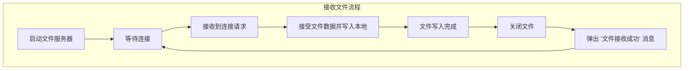
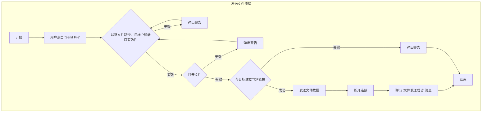

# Lab3-实现网络文件传输

## 1.实验目的

+ 熟练掌握socket API接口

+ 了解文件传输协议并进行简单实现

## 2. 实验内容

+ 在Lab2的基础上实现端到端文件传输（底层协议不限）

+ 传输文件的大小不小于1MB

+ 使用多个c/c++文件编写

+ 用make或cmake编译

## 3. 实验结果

+ 分别启动两个客户端，按照之前lab2时的步骤加入，连接到服务器，在连接到服务器的同时同时开启同于接收文件的TCP端口和进行私聊的UDP端口
+ 输入用于传送的文件的路径，并向私聊的对象发送此文件
+ 私聊文件接受到文件，并将文件保存在程序的路径下面

下图展示的是完成文件传输的两个客户端的情景，在Messages的消息框当中可以看到客户端在连接服务器之后输出的和端口相关的信息。之后使用右边的客户端将文件向左边的客户端进行发送，


下面为接收到的文件和源文件的对比，正确完成了接受

## 4.关键代码解释

### 4.1 文件传输端口确定

```cpp
void ClientApp::connectToServer() {
    QString ip = ipInput->text();
    int port = portInput->text().toInt();

    socket->connectToHost(ip, port);

    if (socket->waitForConnected(3000)) {
        QMessageBox::information(this, "Success", "Connected to server!");
        connectButton->setEnabled(false);
        sendButton->setEnabled(true);
        sendFileButton->setEnabled(true);

        int localPort = socket->localPort();
        if (!bindUdpSocket(localPort)) {
            retryUdpBinding(ip, localPort);
        }

        if (!fileServer->listen(QHostAddress::Any, localPort + 2)) {
            QMessageBox::warning(this, "Error", "Failed to start file server.");
        } else {
            messageDisplay->append("File server started on port " + QString::number(localPort + 2));
        }
    } else {
        QMessageBox::critical(this, "Error", "Failed to connect to server.");
    }
}
```

在完成对于服务器的连接，在和服务器连接的端口localPort+2的位置在此开放一个用于监听的TCP端口，使用

fileServer->listen(QHostAddress::Any, localPort + 2 )进行绑定

### 4.2 接受文件逻辑

```cpp
void ClientApp::acceptFileConnection() {
    fileSocket = fileServer->nextPendingConnection();
    connect(fileSocket, &QTcpSocket::readyRead, this, &ClientApp::receiveFile);
}

void ClientApp::receiveFile() {
    static QFile receivedFile("received_file"); 
    if (!receivedFile.isOpen()) {
        if (!receivedFile.open(QIODevice::WriteOnly)) {
            QMessageBox::warning(this, "Error", "Cannot open file for writing.");
            return;
        }
    }
    
    receivedFile.write(fileSocket->readAll());
    
    if (fileSocket->bytesAvailable() == 0) {
        receivedFile.close();
        QMessageBox::information(this, "File Received", "File saved as 'received_file'.");
        fileSocket->disconnectFromHost();
    }
}
```

**acceptFileConnection**:接受来自客户端的文件连接。

+ fileSocket = fileServer->nextPendingConnection();：这行代码从 `fileServer` 中获取下一个待处理的连接，并将其赋值给 `fileSocket`。`fileServer` 是一个 `QTcpServer` 对象，负责监听和接受来自客户端的连接。
+ connect(fileSocket, &QTcpSocket::readyRead, this, &ClientApp::receiveFile): 这行代码将 fileSocket 的 readyRead 信号连接到 receiveFile 槽。当 fileSocket 上有数据可读时（即文件数据到达时），会触发 receiveFile 方法。

**receiveFile**:接收文件数据并保存到本地文件中
+ static QFile receivedFile("received_file")：创建一个名为 received_file 的文件对象，用于保存接收到的文件数据。由于使用了 static 关键字，这个文件对象在 receiveFile 方法的多次调用中保持不变。
+ if (!receivedFile.isOpen()) { ... }：检查文件是否已经打开。如果未打开，则尝试以写入模式打开文件。如果打开失败，显示一个警告信息框并返回。
+ receivedFile.write(fileSocket->readAll())：从 fileSocket 中读取所有可用的数据并写入到 receivedFile 中。
+ if (fileSocket->bytesAvailable() == 0) { ... }：检查 fileSocket 中是否还有可用字节。如果没有（表示文件传输完成），关闭文件，显示文件接收成功的信息框，并断开与主机的连接。

### 4.3 发送文件逻辑

```cpp
void ClientApp::sendFile() {
    QString targetIp = targetIpInput->text();
    int targetPort = tcpPortToUdpPort(targetPortInput->text().toInt()) + 1; // 文件端口
    
    QString filePath = filePathInput->text();
    if (filePath.isEmpty() || targetIp.isEmpty() || targetPort <= 0) {
        QMessageBox::warning(this, "Error", "Invalid file path or target details.");
        return;
    }
    
    QFile file(filePath);
    if (!file.open(QIODevice::ReadOnly)) {
        QMessageBox::warning(this, "Error", "Cannot open file.");
        return;
    }
    
    QTcpSocket fileSender;
    fileSender.connectToHost(targetIp, targetPort);
    if (!fileSender.waitForConnected(3000)) {
        QMessageBox::warning(this, "Error", "Failed to connect to target file server.");
        return;
    }
    
    QByteArray fileData = file.readAll();
    fileSender.write(fileData);
    fileSender.waitForBytesWritten();
    fileSender.disconnectFromHost();
    
    messageDisplay->append("File sent to " + targetIp + ":" + QString::number(targetPort));
}
```

+ QString targetIp = targetIpInput->text(): 从用户界面获取目标 IP 地址，targetIpInput 是一个输入框，text() 方法返回用户输入的字符串。
+ int targetPort = tcpPortToUdpPort(targetPortInput->text().toInt()) + 1:获取目标端口号。targetPortInput 是另一个输入框，用户输入的文本被转换为整数后通过函数 tcpPortToUdpPort 处理，最后加 1 用于文件传输。
+ QString filePath = filePathInput->text(): 获取要发送的文件路径，filePathInput 是输入框。
+ if (filePath.isEmpty() || targetIp.isEmpty() || targetPort <= 0) {...}:检查文件路径、目标 IP 地址和端口号的有效性。如果任意一个无效，则弹出警告框，提示用户输入无效，并退出该函数。
+ 创建一个 QFile 对象以表示要发送的文件。如果文件无法以只读模式打开，则弹出警告框，提示用户文件无法打开，并退出函数。
```cpp
QFile file(filePath);
    if (!file.open(QIODevice::ReadOnly)) {
        QMessageBox::warning(this, "Error", "Cannot open file.");
        return;
    }
```

+ 创建一个 QTcpSocket 对象 fileSender，并尝试连接到指定的目标 IP 地址和端口。等待最多 3000 毫秒（3 秒）以确认连接。如果连接失败，则弹出警告框，提示连接失败，并退出函数。

```cpp
QTcpSocket fileSender;
fileSender.connectToHost(targetIp, targetPort);
if (!fileSender.waitForConnected(3000)) {
    QMessageBox::warning(this, "Error", "Failed to connect to target file server.");
    return;
}
```

+ 读取文件的所有内容到一个 `QByteArray` 对象 `fileData`。将文件数据写入套接字，发送到目标服务器。`waitForBytesWritten()` 方法会等待直到所有数据都被写入。

```cpp
fileSender.write(fileData);
fileSender.waitForBytesWritten();
fileSender.disconnectFromHost();
```


## 5. 流程图





## 附录

### clientapp.h

```cpp
#ifndef CLIENTAPP_H
#define CLIENTAPP_H

#include <QWidget>
#include <QTcpSocket>
#include <QTcpServer>
#include <QUdpSocket>
#include <QVBoxLayout>
#include <QLineEdit>
#include <QPushButton>
#include <QTextEdit>
#include <QLabel>
#include <QMessageBox>
#include <QFile>
#include <QFileDialog>

class ClientApp : public QWidget {
    Q_OBJECT

public:
    explicit ClientApp(QWidget *parent = nullptr);

private slots:
    void connectToServer();
    bool bindUdpSocket(int port);
    void retryUdpBinding(const QString &ip, int port);
    void sendMessage();
    void readMessage();
    void onDisconnected();
    void sendPrivateMessage();
    void receivePrivateMessage();
    void sendFile();
    void acceptFileConnection();
    void receiveFile();

private:
    QLineEdit *ipInput;
    QLineEdit *portInput;
    QPushButton *connectButton;
    QTextEdit *messageDisplay;
    QLineEdit *messageInput;
    QPushButton *sendButton;

    // Private chat widgets
    QLineEdit *targetIpInput;
    QLineEdit *targetPortInput;
    QLineEdit *privateMessageInput;
    QPushButton *privateSendButton;

    // File transfer widgets
    QLineEdit *filePathInput;
    QPushButton *sendFileButton;

    QTcpSocket *socket;
    QUdpSocket *udpSocket;
    QTcpServer *fileServer;
    QTcpSocket *fileSocket;
    int retryCount;

    int udpPortToTcpPort(int udpPort);
    int tcpPortToUdpPort(int tcpPort);
};

#endif // CLIENTAPP_H

```

### clientapp.cpp

```cpp
#include "clientapp.h"
#include <QApplication>
#include <QMessageBox>
#include <QHostAddress>
#include <QFile>
#include <QTcpSocket>
#include <QUdpSocket>
#include <QTcpServer>

ClientApp::ClientApp(QWidget *parent)
    : QWidget(parent), retryCount(0) {
    setWindowTitle("Socket Client");

    QVBoxLayout *layout = new QVBoxLayout(this);

    // IP and Port
    layout->addWidget(new QLabel("Server IP:"));
    ipInput = new QLineEdit(this);
    layout->addWidget(ipInput);

    layout->addWidget(new QLabel("Port:"));
    portInput = new QLineEdit(this);
    layout->addWidget(portInput);

    // Connect Button
    connectButton = new QPushButton("Connect", this);
    layout->addWidget(connectButton);

    // Message display area
    layout->addWidget(new QLabel("Messages:"));
    messageDisplay = new QTextEdit(this);
    messageDisplay->setReadOnly(true);
    layout->addWidget(messageDisplay);

    // Input and Send Button
    layout->addWidget(new QLabel("Send Message:"));
    messageInput = new QLineEdit(this);
    layout->addWidget(messageInput);

    sendButton = new QPushButton("Send", this);
    sendButton->setEnabled(false);
    layout->addWidget(sendButton);

    // Private chat section
    layout->addWidget(new QLabel("Private Chat - Target IP:"));
    targetIpInput = new QLineEdit(this);
    layout->addWidget(targetIpInput);

    layout->addWidget(new QLabel("Target Port:"));
    targetPortInput = new QLineEdit(this);
    layout->addWidget(targetPortInput);

    privateMessageInput = new QLineEdit(this);
    privateMessageInput->setPlaceholderText("Enter private message here...");
    layout->addWidget(privateMessageInput);

    privateSendButton = new QPushButton("Send Private Message", this);
    privateSendButton->setEnabled(true);
    layout->addWidget(privateSendButton);

    // File transfer section
    layout->addWidget(new QLabel("File Path:"));
    filePathInput = new QLineEdit(this);
    layout->addWidget(filePathInput);

    sendFileButton = new QPushButton("Send File", this);
    sendFileButton->setEnabled(false);
    layout->addWidget(sendFileButton);

    // Sockets and server
    socket = new QTcpSocket(this);
    udpSocket = new QUdpSocket(this);
    fileServer = new QTcpServer(this);

    // Signals and Slots
    connect(connectButton, &QPushButton::clicked, this, &ClientApp::connectToServer);
    connect(sendButton, &QPushButton::clicked, this, &ClientApp::sendMessage);
    connect(socket, &QTcpSocket::readyRead, this, &ClientApp::readMessage);
    connect(socket, &QTcpSocket::disconnected, this, &ClientApp::onDisconnected);
    connect(privateSendButton, &QPushButton::clicked, this, &ClientApp::sendPrivateMessage);
    connect(udpSocket, &QUdpSocket::readyRead, this, &ClientApp::receivePrivateMessage);
    connect(sendFileButton, &QPushButton::clicked, this, &ClientApp::sendFile);
    connect(fileServer, &QTcpServer::newConnection, this, &ClientApp::acceptFileConnection);
}

void ClientApp::connectToServer() {
    QString ip = ipInput->text();
    int port = portInput->text().toInt();

    socket->connectToHost(ip, port);

    if (socket->waitForConnected(3000)) {
        QMessageBox::information(this, "Success", "Connected to server!");
        connectButton->setEnabled(false);
        sendButton->setEnabled(true);
        sendFileButton->setEnabled(true);

        int localPort = socket->localPort();
        if (!bindUdpSocket(localPort)) {
            retryUdpBinding(ip, localPort);
        }

        if (!fileServer->listen(QHostAddress::Any, localPort + 2)) {
            QMessageBox::warning(this, "Error", "Failed to start file server.");
        } else {
            messageDisplay->append("File server started on port " + QString::number(localPort + 2));
        }
    } else {
        QMessageBox::critical(this, "Error", "Failed to connect to server.");
    }
}

bool ClientApp::bindUdpSocket(int port) {
    quint16 udpPort = port + 1;
    if (udpSocket->bind(QHostAddress::Any, udpPort)) {
        messageDisplay->append(QString("UDP socket bound to port %1").arg(udpPort));
        retryCount = 0;
        return true;
    } else {
        messageDisplay->append("Failed to bind UDP socket. Retrying...");
        return false;
    }
}

void ClientApp::retryUdpBinding(const QString &ip, int port) {
    while (retryCount < 3) {
        retryCount++;
        socket->disconnectFromHost();
        socket->connectToHost(ip, port);

        if (socket->waitForConnected(3000)) {
            int localPort = socket->localPort();
            if (bindUdpSocket(localPort)) {
                return;
            }
        }
    }

    QMessageBox::critical(this, "Error", "Failed to bind UDP socket after 3 attempts. Exiting.");
    QApplication::quit();
}

void ClientApp::sendMessage() {
    QString message = messageInput->text();
    if (!message.isEmpty()) {
        socket->write(message.toUtf8());
        socket->flush();
        messageInput->clear();
    }
}

void ClientApp::readMessage() {
    QByteArray data = socket->readAll();
    messageDisplay->append("Server: " + QString(data));
}

void ClientApp::onDisconnected() {
    QMessageBox::information(this, "Disconnected", "Server has closed the connection.");
    connectButton->setEnabled(true);
    sendButton->setEnabled(false);
    sendFileButton->setEnabled(false);
}

void ClientApp::sendPrivateMessage() {
    QString targetIp = targetIpInput->text();
    int targetPort = tcpPortToUdpPort(targetPortInput->text().toInt());
    QString privateMessage = privateMessageInput->text();

    if (!targetIp.isEmpty() && targetPort > 0 && !privateMessage.isEmpty()) {
        QByteArray data = privateMessage.toUtf8();
        udpSocket->writeDatagram(data, QHostAddress(targetIp), targetPort);
        privateMessageInput->clear();
        messageDisplay->append("You (private): " + privateMessage);
    } else {
        QMessageBox::warning(this, "Error", "Please fill in all private chat fields.");
    }
}

void ClientApp::receivePrivateMessage() {
    while (udpSocket->hasPendingDatagrams()) {
        QByteArray buffer;
        buffer.resize(udpSocket->pendingDatagramSize());

        QHostAddress senderIp;
        quint16 senderPort;

        udpSocket->readDatagram(buffer.data(), buffer.size(), &senderIp, &senderPort);

        QString message = QString::fromUtf8(buffer);
        messageDisplay->append(QString("Private (%1:%2): %3")
                               .arg(senderIp.toString())
                               .arg(udpPortToTcpPort(senderPort))
                               .arg(message));
    }
}

void ClientApp::sendFile() {
    QString targetIp = targetIpInput->text();
    int targetPort = tcpPortToUdpPort(targetPortInput->text().toInt()) + 1; // 文件端口
    
    QString filePath = filePathInput->text();
    if (filePath.isEmpty() || targetIp.isEmpty() || targetPort <= 0) {
        QMessageBox::warning(this, "Error", "Invalid file path or target details.");
        return;
    }
    
    QFile file(filePath);
    if (!file.open(QIODevice::ReadOnly)) {
        QMessageBox::warning(this, "Error", "Cannot open file.");
        return;
    }
    
    QTcpSocket fileSender;
    fileSender.connectToHost(targetIp, targetPort);
    if (!fileSender.waitForConnected(3000)) {
        QMessageBox::warning(this, "Error", "Failed to connect to target file server.");
        return;
    }
    
    QByteArray fileData = file.readAll();
    fileSender.write(fileData);
    fileSender.waitForBytesWritten();
    fileSender.disconnectFromHost();
    
    messageDisplay->append("File sent to " + targetIp + ":" + QString::number(targetPort));
}


void ClientApp::acceptFileConnection() {
    fileSocket = fileServer->nextPendingConnection();
    connect(fileSocket, &QTcpSocket::readyRead, this, &ClientApp::receiveFile);
}

void ClientApp::receiveFile() {
    static QFile receivedFile("received_file"); 
    if (!receivedFile.isOpen()) {
        if (!receivedFile.open(QIODevice::WriteOnly)) {
            QMessageBox::warning(this, "Error", "Cannot open file for writing.");
            return;
        }
    }
    
    receivedFile.write(fileSocket->readAll());
    
    if (fileSocket->bytesAvailable() == 0) {
        receivedFile.close();
        QMessageBox::information(this, "File Received", "File saved as 'received_file'.");
        fileSocket->disconnectFromHost();
    }
}

int ClientApp::udpPortToTcpPort(int udpPort) {
    return udpPort - 1;
}

int ClientApp::tcpPortToUdpPort(int tcpPort) {
    return tcpPort + 1;
}

```

### main.cpp

```cpp
#include <QApplication>
#include "clientapp.h"

int main(int argc, char *argv[]) {
    QApplication app(argc, argv);
    
    ClientApp client;
    client.resize(400, 500);
    client.show();
    
    return app.exec();
}

```

### CMakeLists.txt

```cmake
cmake_minimum_required(VERSION 3.5)

project(SocketClient)

# 设置 Qt 的路径
find_package(Qt5 REQUIRED COMPONENTS Core Widgets Network)

# 启用 AUTOMOC 处理 Qt 元对象
set(CMAKE_AUTOMOC ON)

# 设置 C++ 标准
set(CMAKE_CXX_STANDARD 11)
set(CMAKE_CXX_STANDARD_REQUIRED ON)

# 添加源文件
set(SOURCES
    main.cpp
    clientapp.cpp
)

# 添加头文件
set(HEADERS
    clientapp.h
)

# 设置可执行文件
add_executable(SocketClient ${SOURCES} ${HEADERS})

target_link_libraries(SocketClient Qt5::Core Qt5::Widgets Qt5::Network)

target_link_libraries(SocketClient ${QT_LIBRARIES})


```

