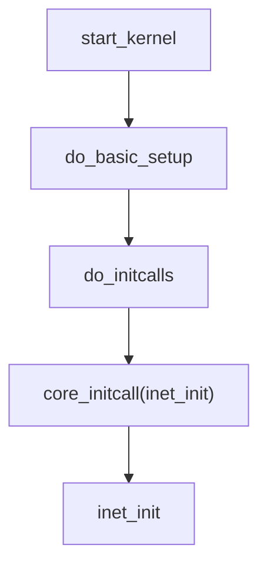
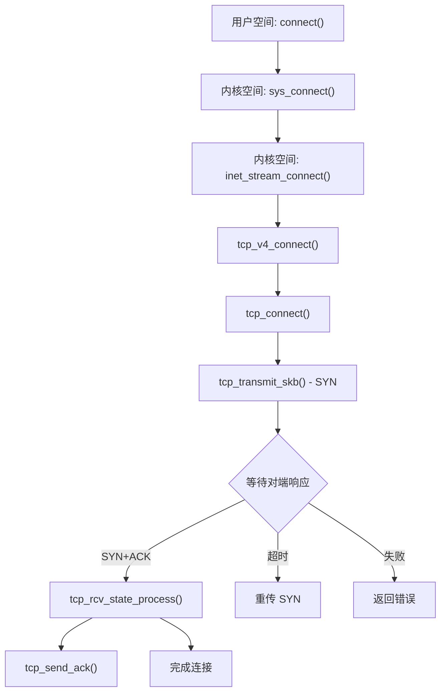
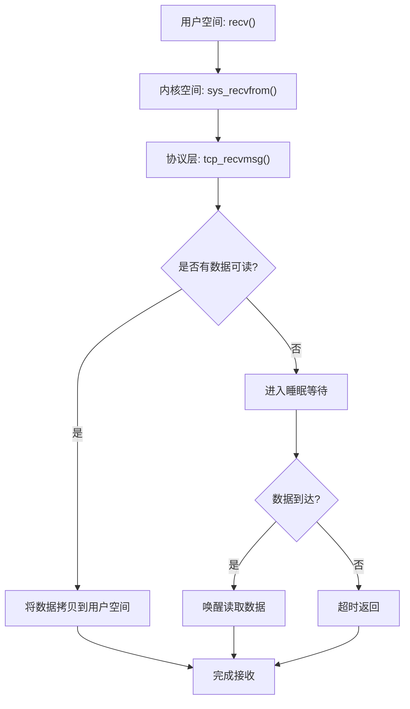
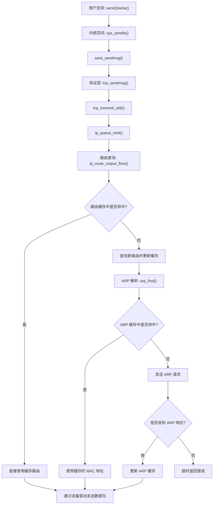

# **Lab4-阅读源码，理解TCP、 IP协议栈**

## 1. 实验内容

+ 阅读、理解Linux内核源码
+ 根据Linux内核源码及实验过程记录回答问题，提交实验报告

## 2. 实验目的

+ 熟悉Linux内核源码
+ 理解TCP、IP协议栈的实际实现
+ 熟悉Linux内核运行逻辑

## 3. 回答相关问题

### 3.1 inet_init是如何被调用的？写出start_kernel到inet_init调用路径



+ **start_kernel**:即是Linux内核的起点，相当于我们普通C程序的main函数，这个start_kernel也是整个Linux内核启动的起点，可以在内核代码路面init/main.c中找到`start_kernel`函数，这个地方就是初始化Linux内核启动的起点。在start_kernel当中调用了函数`rest_init()`
+ **rest_init:** rest_init在 linux-src/init/main.c 当中393行左右的位置

```cpp
393static noinline void __init_refok rest_init(void)
394{
395	int pid;
396
397	rcu_scheduler_starting();
398	/*
399	 * We need to spawn init first so that it obtains pid 1, however
400	 * the init task will end up wanting to create kthreads, which, if
401	 * we schedule it before we create kthreadd, will OOPS.
402	 */
403	kernel_thread(kernel_init, NULL, CLONE_FS);
404	numa_default_policy();
405	pid = kernel_thread(kthreadd, NULL, CLONE_FS | CLONE_FILES);
406	rcu_read_lock();
407	kthreadd_task = find_task_by_pid_ns(pid, &init_pid_ns);
408	rcu_read_unlock();
409	complete(&kthreadd_done);
410
411	/*
412	 * The boot idle thread must execute schedule()
413	 * at least once to get things moving:
414	 */
415	init_idle_bootup_task(current);
416	schedule_preempt_disabled();
417	/* Call into cpu_idle with preempt disabled */
418	cpu_startup_entry(CPUHP_ONLINE);
419}
```

通过`rest_init()`新建`kernel_init`、`kthreadd`内核线程。403行代码 `kernel_thread(kernel_init, NULL, CLONE_FS);`，由注释得调用 `kernel_thread()`创建1号内核线程（在`kernel_init`函数正式启动），`kernel_init`函数启动了init用户程序。

另外405行代码 `pid = kernel_thread(kthreadd, NULL, CLONE_FS | CLONE_FILES);` 调用`kernel_thread`执行`kthreadd`，创建PID为2的内核线程。

`rest_init()`最后调用`cpu_idle()` 演变成了idle进程

+ **kernel_init函数和do_basic_setup函数：**`kernel_init`函数的主要工作是加载init用户程序，但是在加载init用户程序前通过kernel_init_freeable函数进一步做了一些初始化的工作。

```cpp
930static int __ref kernel_init(void *unused)
931{
932	int ret;
933
934	kernel_init_freeable();
935	/* need to finish all async __init code before freeing the memory */
936	async_synchronize_full();
937	free_initmem();
938	mark_rodata_ro();
939	system_state = SYSTEM_RUNNING;
940	numa_default_policy();
941
942	flush_delayed_fput();
943
944	if (ramdisk_execute_command) {
945		ret = run_init_process(ramdisk_execute_command);
946		if (!ret)
947			return 0;
948		pr_err("Failed to execute %s (error %d)\n",
949		       ramdisk_execute_command, ret);
950	}
951
952	/*
953	 * We try each of these until one succeeds.
954	 *
955	 * The Bourne shell can be used instead of init if we are
956	 * trying to recover a really broken machine.
957	 */
958	if (execute_command) {
959		ret = run_init_process(execute_command);
960		if (!ret)
961			return 0;
962		pr_err("Failed to execute %s (error %d).  Attempting defaults...\n",
963			execute_command, ret);
964	}
965	if (!try_to_run_init_process("/sbin/init") ||
966	    !try_to_run_init_process("/etc/init") ||
967	    !try_to_run_init_process("/bin/init") ||
968	    !try_to_run_init_process("/bin/sh"))
969		return 0;
970
971	panic("No working init found.  Try passing init= option to kernel. "
972	      "See Linux Documentation/init.txt for guidance.");
973}
974
975static noinline void __init kernel_init_freeable(void)
976{
977	/*
978	 * Wait until kthreadd is all set-up.
979	 */
980	wait_for_completion(&kthreadd_done);
981
...
1004	do_basic_setup();
1005
...
1033}
1034
```

`kernel_init_freeable`函数做的一些初始化的工作与我们网络初始化有关的主要在`do_basic_setup`函数中，其中`do_initcalls`用一种巧妙的方式对一些子系统进行了初始化，其中包括TCP/IP网络协议栈的初始化。

```cpp
867/*
868 * Ok, the machine is now initialized. None of the devices
869 * have been touched yet, but the CPU subsystem is up and
870 * running, and memory and process management works.
871 *
872 * Now we can finally start doing some real work..
873 */
874static void __init do_basic_setup(void)
875{
876	cpuset_init_smp();
877	usermodehelper_init();
878	shmem_init();
879	driver_init();
880	init_irq_proc();
881	do_ctors();
882	usermodehelper_enable();
883	do_initcalls();
884	random_int_secret_init();
885}
```

+ **do_initcalls函数：**do_initcalls函数是table驱动的，维护了一个initcalls的table，从而可以对每一个注册进来的初始化项目进行初始化，这个巧妙的机制可以理解成观察者模式，每一个协议子系统是一个观察者，将它的初始化入口注册进来，do_initcalls函数是被观察者负责统一调用每一个子系统的初始化函数指针。

```cpp
859static void __init do_initcalls(void)
860{
861	int level;
862
863	for (level = 0; level < ARRAY_SIZE(initcall_levels) - 1; level++)
864		do_initcall_level(level);
865}
```

`inet_init`函数是TCP/IP协议栈初始化的入口函数，通过`fs_initcall(inet_init)`将`inet_init`函数注册进initcalls的table。这里do_initcalls的注册和调用机制是通过复杂的宏来实现的.

### 3.2 跟踪分析TCP/IP协议栈是如何将自己与上层套接口及下层数据链路层关联起来的

TCP/IP协议栈与上层套接口和下层数据链路层的关联主要通过以下几个方面实现：

+ **套接口层和传输层的关联**：套接口层提供了一组通用的操作函数，如socket、bind、connect、send、recv等，这些函数通过**调用传输层的相应函数**，实现了套接口层和传输层的关联。例如，当用户调用socket函数创建一个TCP套接口时，套接口层会调用inet_create函数，该函数位于net/ipv4/af_inet.c中，它会根据传入的协议参数，调用相应的传输层协议的create函数，如tcp_create，该函数位于net/ipv4/tcp.c中，它会为套接口分配一个sock结构，并初始化其相关字段和操作函数。这样，套接口就与传输层的sock结构关联起来了。

+ **传输层和网络层的关联**：传输层和网络层的关联主要通过**协议注册和分发实现**。传输层协议，如TCP和UDP，会在初始化时，通过inet_add_protocol函数，将自己的协议号和处理函数注册到网络层的inet_protos数组中，该函数位于net/ipv4/protocol.c中。当网络层接收到一个IP数据包时，会根据其协议号，从inet_protos数组中查找相应的传输层协议的处理函数，并调用它。例如，当网络层调用ip_local_deliver_finish函数处理一个本地目的的IP数据包时，该函数位于net/ipv4/ip_input.c中，它会根据IP数据包的协议号，从inet_protos数组中查找相应的传输层协议的处理函数，如tcp_v4_rcv，该函数位于net/ipv4/tcp_ipv4.c中，它会处理TCP数据包，并调用相应的sock结构的操作函数。这样，网络层就与传输层的协议和sock结构关联起来了。

+ **网络层和数据链路层的关联**：网络层和数据链路层的关联主要通过网络设备和数据包类型实现。网络设备是一种抽象的数据结构，用于表示各种物理或虚拟的网络接口，如以太网卡、回环设备等，它们都有一个net_device结构，该结构位于include/linux/netdevice.h中，它包含了网络设备的各种属性和操作函数。数据包类型是一种用于表示不同协议的数据包的结构，如IP数据包、ARP数据包等，它们都有一个packet_type结构，该结构位于include/linux/if_packet.h中，它包含了数据包类型的协议号和处理函数。当网络层发送一个IP数据包时，会调用ip_output函数，该函数位于net/ipv4/ip_output.c中，它会根据目的IP地址，查找路由表，找到相应的网络设备和下一跳地址，然后调用网络设备的hard_header函数，该函数位于net/core/dev.c中，它会根据网络设备的类型，如eth_header，该函数位于net/ethernet/eth.c中，为IP数据包添加一个以太网帧头，然后调用网络设备的xmit函数，如dev_queue_xmit，该函数位于net/core/dev.c中，它会将IP数据包加入到网络设备的发送队列中，等待发送。当数据链路层接收到一个以太网帧时，会调用netif_receive_skb函数，该函数位于net/core/dev.c中，它会根据以太网帧头的协议号，从ptype_all链表中查找相应的数据包类型的处理函数，并调用它。例如，当数据链路层接收到一个IP数据包时，会调用ip_rcv函数，该函数位于net/ipv4/ip_input.c中，它会处理IP数据包，并调用相应的传输层协议的处理函数。这样，网络层就与数据链路层的网络设备和数据包类型关联起来了。

### 3.3 TCP的三次握手源代码跟踪分析，跟踪找出设置和发送SYN/ACK的位置，以及状态转换的位




TCP的三次握手从用户程序的角度看就是客户端connect和服务端accept建立起连接时背后的完成的工作，在内核socket接口层这两个socket API函数对应着sys_connect和sys_accept函数，进一步对应着sock->opt->connect和sock->opt->accept两个函数指针，在TCP协议中这两个函数指针对应着tcp_v4_connect函数和inet_csk_accept函数。
**客户端的流程**：
+ 发送SYN报文，向服务器发起TCP连接：当客户端调用connect函数连接服务器时，套接口层会调用inet_stream_connect函数，该函数位于net/ipv4/af_inet.c中，它会调用传输层的connect函数，如tcp_v4_connect
  + **tcp_v4_connect函数**:的主要作用就是发起一个TCP连接，建立TCP连接的过程自然需要底层协议的支持，因此我们从这个函数中可以看到它调用了IP层提供的一些服务，比如ip_route_connect和ip_route_newports从名称就可以简单分辨，这里我们关注在TCP层面的三次握手，不去深究底层协议提供的功能细节。我们可以看到这里设置了 TCP_SYN_SENT并进一步调用了 tcp_connect(sk)来实际构造SYN并发送出去。主要会完成下面几个步骤
    + 为连接分配一个本地端口号，如果没有指定，会调用inet_hash_connect函数，该函数位于net/ipv4/inet_hashtables.c中，它会从ephemeral端口范围中选择一个未使用的端口号，并将其与sock结构关联。
    + 根据目的IP地址，查找路由表，找到相应的网络设备和下一跳地址，然后调用网络设备的hard_header函数，该函数位于net/core/dev.c中，它会根据网络设备的类型，如eth_header，该函数位于net/ethernet/eth.c中，为IP数据包添加一个以太网帧头，然后调用网络设备的xmit函数，如dev_queue_xmit，该函数位于net/core/dev.c中，它会将IP数据包加入到网络设备的发送队列中，等待发送。这样，就完成了SYN报文的发送，同时将TCP状态从CLOSED变为SYN_SENT。
    + 设置和发送SYN报文的位置：tcp_v4_connect -> ip_output -> dev_queue_xmit
    + 状态转换的位置：tcp_v4_connect -> tcp_set_state -> inet_sk_state_store

```cpp
140/* This will initiate an outgoing connection. */
141int tcp_v4_connect(struct sock *sk, struct sockaddr *uaddr, int addr_len)
142{
...
171	rt = ip_route_connect(fl4, nexthop, inet->inet_saddr,
172			      RT_CONN_FLAGS(sk), sk->sk_bound_dev_if,
173			      IPPROTO_TCP,
174			      orig_sport, orig_dport, sk);
...
215	/* Socket identity is still unknown (sport may be zero).
216	 * However we set state to SYN-SENT and not releasing socket
217	 * lock select source port, enter ourselves into the hash tables and
218	 * complete initialization after this.
219	 */
220	tcp_set_state(sk, TCP_SYN_SENT);
...
227	rt = ip_route_newports(fl4, rt, orig_sport, orig_dport,
228			       inet->inet_sport, inet->inet_dport, sk);
...
246	err = tcp_connect(sk);
...
264}
265EXPORT_SYMBOL(tcp_v4_connect);
```

+ 收到服务器的SYN+ACK报文，发送ACK报文，完成TCP连接的建立：当客户端收到服务器的SYN+ACK报文时，数据链路层会调用netif_receive_skb函数，该函数位于net/core/dev.c中，它会根据以太网帧头的协议号，从ptype_all链表中查找相应的数据包类型的处理函数，并调用它。例如，当数据链路层接收到一个IP数据包时，会调用ip_rcv函数，该函数位于net/ipv4/ip_input.c中，它会处理IP数据包，并调用相应的传输层协议的处理函数。

  + **tcp_v4_rcv函数**：该函数位于net/ipv4/tcp_ipv4.c中，它会完成以下几个步骤
    + 根据TCP报文头的源端口号和目的端口号，从hash表中查找相应的sock结构，如果找不到，就丢弃该报文，如果找到，就将该报文加入到sock结构的接收队列中，然后唤醒等待该sock结构的进程，即connect函数。
    + 调用tcp_rcv_established函数，该函数位于net/ipv4/tcp_input.c中，它会根据TCP报文头的标志位，执行相应的操作，对于SYN+ACK报文来说，会调用tcp_ack函数，该函数位于net/ipv4/tcp_input.c中，它会完成以下几个步骤：
      + 检查ACK序号是否有效，如果无效，就丢弃该报文，如果有效，就更新sock结构的相关字段，如snd_una，snd_wnd等。
      + 检查SYN标志位是否有效，如果无效，就丢弃该报文，如果有效，就更新sock结构的相关字段，如rcv_nxt，rcv_wnd等。
      + 调用tcp_send_ack函数，该函数位于net/ipv4/tcp_output.c中，它会创建一个ACK报文，并发送给服务器，以确认收到了SYN+ACK报文。
      + 将TCP状态从SYN_SENT变为ESTABLISHED，表示TCP连接已经建立。
    + 设置和发送ACK报文的位置：tcp_v4_rcv -> tcp_ack -> tcp_send_ack
    + 状态转换的位置：tcp_v4_rcv -> tcp_ack -> tcp_set_state -> inet_sk_state_store
    
    ```cpp
    int tcp_v4_rcv(struct sk_buff *skb)
    {
      ...
      th = (const struct tcphdr *)skb->data;
    	iph = ip_hdr(skb);
    lookup:
    	sk = __inet_lookup_skb(&tcp_hashinfo, skb, __tcp_hdrlen(th), th->source,
    			       th->dest, sdif, &refcounted);
      ...
    process:
    	if (sk->sk_state == TCP_TIME_WAIT)
    		goto do_time_wait;
    
    	if (sk->sk_state == TCP_NEW_SYN_RECV) {
        ...
      }
      ...
    	if (sk->sk_state == TCP_LISTEN) {
    		ret = tcp_v4_do_rcv(sk, skb);
    		goto put_and_return;
    	}
      ...
    	if (!sock_owned_by_user(sk)) {
    		skb_to_free = sk->sk_rx_skb_cache;
    		sk->sk_rx_skb_cache = NULL;
    		ret = tcp_v4_do_rcv(sk, skb);
    	} else {
    		if (tcp_add_backlog(sk, skb))
    			goto discard_and_relse;
    		skb_to_free = NULL;
    	}
      ...
    do_time_wait:
    	if (!xfrm4_policy_check(NULL, XFRM_POLICY_IN, skb)) {
    		inet_twsk_put(inet_twsk(sk));
    		goto discard_it;
    	}
    
    	tcp_v4_fill_cb(skb, iph, th);
    
    	if (tcp_checksum_complete(skb)) {
    		inet_twsk_put(inet_twsk(sk));
    		goto csum_error;
    	}
    	switch (tcp_timewait_state_process(inet_twsk(sk), skb, th)) {
    	case TCP_TW_SYN: {
    		struct sock *sk2 = inet_lookup_listener(dev_net(skb->dev),
    							&tcp_hashinfo, skb,
    							__tcp_hdrlen(th),
    							iph->saddr, th->source,
    							iph->daddr, th->dest,
    							inet_iif(skb),
    							sdif);
    		if (sk2) {
    			inet_twsk_deschedule_put(inet_twsk(sk));
    			sk = sk2;
    			tcp_v4_restore_cb(skb);
    			refcounted = false;
    			goto process;
    		}
    	}
    		/* to ACK */
    		/* fall through */
    	case TCP_TW_ACK:
    		tcp_v4_timewait_ack(sk, skb);
    		break;
    	case TCP_TW_RST:
    		tcp_v4_send_reset(sk, skb);
    		inet_twsk_deschedule_put(inet_twsk(sk));
    		goto discard_it;
    	case TCP_TW_SUCCESS:;
    	}
    	goto discard_it;
    }
    ```

**服务器端流程**
+ 收到客户端的SYN报文，发送SYN+ACK报文，回应TCP连接请求:当服务器端收到客户端的SYN报文时，数据链路层会调用netif_receive_skb函数，该函数位于net/core/dev.c中，它会根据以太网帧头的协议号，从ptype_all链表中查找相应的数据包类型的处理函数，并调用它。例如，当数据链路层接收到一个IP数据包时，会调用ip_rcv函数，该函数位于net/ipv4/ip_input.c中，它会处理IP数据包，并调用相应的传输层协议的处理函数。对于TCP协议来说，会调用tcp_v4_rcv函数.
	+ **tcp_v4_rcv**:该函数位于net/ipv4/tcp_ipv4.c中，它会完成以下几个步骤：
	  + 根据TCP报文头的源端口号和目的端口号，从hash表中查找相应的sock结构，如果找不到，就丢弃该报文，如果找到，就判断该sock结构是否处于LISTEN状态，如果不是，就丢弃该报文，如果是，就继续处理。
	  
	  + 调用tcp_v4_do_rcv函数，该函数位于net/ipv4/tcp_ipv4.c中，它会根据TCP报文头的标志位，执行相应的操作，对于SYN报文来说，会调用tcp_v4_conn_request函数，该函数位于net/ipv4/tcp_ipv4.c中，它会完成以下几个步骤：
	    + 检查SYN报文是否有效，如果无效，就丢弃该报文，如果有效，就继续处理。
	    + 为连接分配一个新的sock结构，称为子sock结构，它会继承父sock结构的一些属性，如本地地址，本地端口号等，同时为子sock结构分配一个新的本地序号，作为ISN。
	    + 将子sock结构加入到父sock结构的accept队列中，等待被accept函数接受。
	    + 调用tcp_make_synack函数，该函数位于net/ipv4/tcp_output.c中，它会创建一个SYN+ACK报文，并发送给客户端，以回应TCP连接请求，同时将TCP状态从LISTEN变为SYN_RECV。
	    
	    
	    
	  + 设置和发送SYN+ACK报文的位置：tcp_v4_rcv -> tcp_v4_conn_request -> tcp_make_synack
	  
	  + 状态转换的位置：tcp_v4_rcv -> tcp_v4_conn_request -> tcp_set_state -> inet_sk_state_store
	
+ 收到客户端的ACK报文，完成TCP连接的建立:当服务器端收到客户端的ACK报文时，数据链路层会调用netif_receive_skb函数，该函数位于net/core/dev.c中，它会根据以太网帧头的协议号，从ptype_all链表中查找相应的数据包类型的处理函数，并调用它。例如，当数据链路层接收到一个IP数据包时，会调用ip_rcv函数，该函数位于net/ipv4/ip_input.c中，它会处理IP数据包，并调用相应的传输层协议的处理函数。对于TCP协议来说，会调用tcp_v4_rcv函数，该函数位于net/ipv4/tcp_ipv4.c中，它会完成以下几个步骤：
	+ 根据TCP报文头的源端口号和目的端口号，从hash表中查找相应的sock结构，如果找不到，就丢弃该报文，如果找到，就判断该sock结构是否处于SYN_RECV状态，如果不是，就丢弃该报文，如果是，就继续处理。
	+ 调用tcp_rcv_established函数，该函数位于net/ipv4/tcp_input.c中，它会根据TCP报文头的标志位，执行相应的操作，对于ACK报文来说，会调用tcp_ack函数，该函数位于net/ipv4/tcp_input.c中，它会完成以下几个步骤：
	  + 检查ACK序号是否有效，如果无效，就丢弃该报文，如果有效，就更新sock结构的相关字段，如snd_una，snd_wnd等。
	  + 将TCP状态从SYN_RECV变为ESTABLISHED，表示TCP连接已经建立。
	  + 将sock结构从父sock结构的accept队列中移动到已完成连接的队列中，等待被accept函数接受。
	  + 状态转换的位置：tcp_v4_rcv -> tcp_ack -> tcp_set_state -> inet_sk_state_store

```cpp
int tcp_v4_rcv(struct sk_buff *skb)
{
  ...
  th = (const struct tcphdr *)skb->data;
	iph = ip_hdr(skb);
lookup:
	sk = __inet_lookup_skb(&tcp_hashinfo, skb, __tcp_hdrlen(th), th->source,
			       th->dest, sdif, &refcounted);
  ...
process:
	if (sk->sk_state == TCP_TIME_WAIT)
		goto do_time_wait;

	if (sk->sk_state == TCP_NEW_SYN_RECV) {
    ...
  }
  ...
	if (sk->sk_state == TCP_LISTEN) {
		ret = tcp_v4_do_rcv(sk, skb);
		goto put_and_return;
	}
  ...
	if (!sock_owned_by_user(sk)) {
		skb_to_free = sk->sk_rx_skb_cache;
		sk->sk_rx_skb_cache = NULL;
		ret = tcp_v4_do_rcv(sk, skb);
	} else {
		if (tcp_add_backlog(sk, skb))
			goto discard_and_relse;
		skb_to_free = NULL;
	}
  ...
do_time_wait:
	if (!xfrm4_policy_check(NULL, XFRM_POLICY_IN, skb)) {
		inet_twsk_put(inet_twsk(sk));
		goto discard_it;
	}

	tcp_v4_fill_cb(skb, iph, th);

	if (tcp_checksum_complete(skb)) {
		inet_twsk_put(inet_twsk(sk));
		goto csum_error;
	}
	switch (tcp_timewait_state_process(inet_twsk(sk), skb, th)) {
	case TCP_TW_SYN: {
		struct sock *sk2 = inet_lookup_listener(dev_net(skb->dev),
							&tcp_hashinfo, skb,
							__tcp_hdrlen(th),
							iph->saddr, th->source,
							iph->daddr, th->dest,
							inet_iif(skb),
							sdif);
		if (sk2) {
			inet_twsk_deschedule_put(inet_twsk(sk));
			sk = sk2;
			tcp_v4_restore_cb(skb);
			refcounted = false;
			goto process;
		}
	}
		/* to ACK */
		/* fall through */
	case TCP_TW_ACK:
		tcp_v4_timewait_ack(sk, skb);
		break;
	case TCP_TW_RST:
		tcp_v4_send_reset(sk, skb);
		inet_twsk_deschedule_put(inet_twsk(sk));
		goto discard_it;
	case TCP_TW_SUCCESS:;
	}
	goto discard_it;
}
```


### 3.4 recv在TCP/IP协议栈中的执行路径



当用户调用recv函数接收数据时，套接口层会调用inet_recvmsg函数，该函数位于net/ipv4/af_inet.c中，它会调用传输层的recvmsg函数，如tcp_recvmsg，该函数位于net/ipv4/tcp.c中，它会完成以下几个步骤：

+ 检查sock结构的状态是否为ESTABLISHED，如果不是，就返回错误，如果是，就继续处理。
+ 检查sock结构的接收队列是否为空，如果为空，就判断是否是非阻塞模式，如果是，就返回错误，如果不是，就进入睡眠状态，等待被唤醒，如果不为空，就继续处理。
+ 调用skb_copy_datagram_iovec函数，该函数位于net/core/datagram.c中，它会将sock结构的接收队列中的第一个sk_buff结构的数据拷贝到用户的缓冲区中，然后返回。
+ recv在TCP/IP协议栈中的执行路径：recv -> inet_recvmsg -> tcp_recvmsg -> skb_copy_datagram_iovec

### 3.5 跟踪TCP send过程中的路由查询和ARP解析的最底层实现




send在TCP/IP协议栈中的执行路径，其中涉及到了两个重要的过程，一是路由查询，即根据目的IP地址，查找路由表，找到相应的网络设备和下一跳地址，二是ARP解析，即根据下一跳地址，查找ARP缓存，找到相应的MAC地址。这两个过程都是在网络层的ip_output函数中完成的，该函数位于net/ipv4/ip_output.c中，它会调用以下几个函数

+ ip_route_output_flow函数，该函数位于net/ipv4/route.c中，它会根据目的IP地址，源IP地址，传输层协议，传输层端口等参数，创建一个名为fl4的结构，该结构位于include/net/flow.h中，它包含了路由查询的关键信息，然后调用fib_lookup函数，该函数位于net/ipv4/fib_frontend.c中，它会根据fl4结构，从fib_info_hash哈希表中查找匹配的路由信息，如果找不到，就返回错误，如果找到，就返回一个名为res的结构，该结构位于include/net/flow.h中，它包含了路由查询的结果，如网络设备，下一跳地址等，然后调用ip_route_create_rcu函数，该函数位于net/ipv4/route.c中，它会根据res结构，创建一个名为rth的结构，该结构是rtable结构的指针，它包含了路由表项的信息，然后将rth结构加入到rt_hash_table哈希表中，方便下次查找，最后返回rth结构给ip_output函数。
+ arp_bind_neighbour函数，该函数位于net/ipv4/arp.c中，它会根据rth结构中的网络设备和下一跳地址，从ARP缓存中查找是否有对应的MAC地址，如果有，就直接返回，如果没有，就调用arp_find函数，该函数位于net/ipv4/arp.c中，它会为下一跳地址分配一个arp_table结构，并将其加入到ARP缓存中，然后调用arp_solicit函数，该函数位于net/ipv4/arp.c中，它会发送一个ARP请求报文，以询问下一跳地址的MAC地址，同时将arp_table结构的状态设置为NUD_INCOMPLETE，表示正在等待ARP应答，最后返回arp_table结构给arp_bind_neighbour函数。
